# README

## :page_with_curl: Semesterarbeit 3 - test-push-3


| :ticket: Titel:                   | TrackMyGym: Tracke. Wachse. Gewinne.     |
| ----------------------------------- | ------------------------------------------ |
| :bust_in_silhouette: Studierende: | Lilia Mechani                            |
| :busts_in_silhouette: Dozenten:   | (PRJ) Corrado Parisi (MSVC) Boris Langer |


| :round_pushpin: Topics:             |
| ------------------------------------- |
| :computer: Microservices            |
| :paperclip: PRJ (Projektmanagement) |

# TrackMyGym: Tracke. Wachse. Gewinne.

## Inhaltsverzeichnis

## 📋 Projektübersicht

* [Einführung / README](#einführung--readme)
* [Projektinformationen](#projektinformationen)

### [1. 📊 Projektmanagement](#1--projektmanagement)

* [1.1 Projektbeschreibung](#11-projektbeschreibung)
* [1.2 Zeitplan](#12-zeitplan)
* [1.3 Risiko-Evaluation](#13-risiko-evaluation)
* [1.4 Risiko-Matrix](#14-risiko-matrix)
* [1.5 SWOT-Analyse](#15-swot-analyse)
* [1.6 Sprint-Dokumentation](#16-sprint-dokumentation)
  * [1.6.1 Sprint 1](#161-sprint-1)
  * [1.6.2 Sprint 2](#162-sprint-2)
  * [1.6.3 Sprint 3](#163-sprint-3)
* [1.7 Projekterweiterung](#17-projekterweiterung)
  * [1.7.1 Beschrieb zur Projekterweiterung](#171-beschrieb-zur-projekterweiterung)
  * [1.7.2 SEUSAG-Diagramm - Alte Struktur](#172-seusag-diagramm---alte-struktur)
  * [1.7.3 Neue Struktur](#173-neue-struktur)
  * [1.7.4 Neue Struktur ()](#174-neue-struktur) LIIIIIIIIIIIIINK
* [1.8 Projekt Gantt-Diagramm](#18-projekt-gantt-diagramm)

### [2. 🛠️ Technische Dokumentation](#2-️-technische-dokumentation)

* [2.1 Architektur-Übersicht](#21-architektur-übersicht)
* [2.2 Microservices](#22-microservices)
  * [2.2.1 Frontend Service](#221-frontend-service)
  * [2.2.2 User Service](#222-user-service)
  * [2.2.3 Workout Service](#223-workout-service)
  * [2.2.4 Stats Service](#224-stats-service)
  * [2.2.5 Weather Service](#224-stats-service) LIIIIIIIIIIIIIIIIIINK

### [3. ☁️ Deployment & DevOps](#3-️-deployment--devops)

* [3.1 AWS EC2 Setup](#31-aws-ec2-setup)
* [3.2 CI/CD Pipeline](#32-cicd-pipeline)
* [3.3 GitHub Actions](#33-github-actions)
* [3.4 Produktionsumgebung](#34-produktionsumgebung)

### [4. 📱 User Interface](#4--user-interface)

* [4.1 Frontend Design](#41-frontend-design)
* [4.2 User Experience](#42-user-experience)
* [4.3 Screenshots](#43-screenshots)

### [5. 🧪 Testing & Qualitätssicherung](#5--testing--qualitätssicherung)

* [5.1 Pipeline-Testing](#51-pipeline-testing)
* [5.2 User-Testing](#52-user-testing)
* [5.3 10 Testfälle](#53-10-testfälle)

### [6. 📈 Ergebnisse & Reflexion](#6--ergebnisse--reflexion)

* [6.1 Erreichte Ziele](#61-erreichte-ziele)
* [6.2 Herausforderungen](#62-herausforderungen)
* [6.3 Lessons Learned](#63-lessons-learned)
* [6.4 Ausblick](#64-ausblick)

### [7. 📚 Anhang](#7--anhang)

* [7.1 Code-Repository](#71-code-repository)
* [7.2 Verwendete Technologien](#72-verwendete-technologien)
* [7.3 Quellen](#73-quellen)
* [7.4 Glossar](#74-glossar)
* [7.5 Kontaktangaben](#75-kontaktangaben)

---

## Quick Navigation

* 🚀[Live Demo](platzhalter)
* 💻[GitHub Repository](platzhalter)
* 📊[KanBan Projekt Board](platzhalter)

---

## Einführung / README

Willkommen zum Sprint Elemente Projekt...

## Projektinformationen

Grundlegende Informationen zum Projekt...

---

# 1. 📊 Projektmanagement

## 1.1 Projektbeschreibung

TrackMyGym: Tracke. Wachse. Gewinne.
Projektplanung
TrackMyGym ist eine Fitness-App, mit der Nutzer ihre Gym-Aktivitäten verfolgen können. Die App soll einfach erfassen, wann jemand im Gym war, welche Übungen gemacht wurden und mit welchen Gewichten trainiert wurde.
Die App TrackMyGym soll Benutzer auf mehreren Ebenen motivieren:
Durch Visualisierung des Fortschritts - indem Benutzer ihre Entwicklung über Zeit sehen können, erkennen sie ihre Verbesserungen konkret, was motivierender ist als subjektive Eindrücke
Durch Gewohnheitsbildung - das tägliche Check-in-System schafft eine Routine und macht regelmässige Gym-Besuche zur Gewohnheit
Durch Erfolgsbestätigung - die Dokumentation von steigenden Gewichten oder verbesserten Leistungen liefert messbare Beweise für den Trainingsfortschritt
Durch soziale Aspekte (in späteren Versionen) - Freunde und Gruppen sorgen für Verantwortungsgefühl und gesunden Wettbewerb
Durch Gamification-Elemente wie Leaderboards (In späteren Versionen) - der Vergleich mit anderen schafft zusätzliche Anreize durch freundschaftlichen Wettbewerb

Die App soll auf folgenden Technologien basieren:

- Backend: Python mit Flask (Microservices)
- Deployment: Docker-Container
- API: REST-Schnittstellen (Für motivierende Push-Notifications)

Persönlicher Bezug

Als regelmässiger Gym-Besucher fehlt mir eine einfache App, die meine Fortschritte trackt und gleichzeitig soziale Elemente bietet. TrackMyGym soll genau diese Lücke füllen und mir sowie anderen Fitness-Fans helfen, motiviert zu bleiben
TrackMyGym – Fortschritt messbar machen!


| :checkered_flag: Angezielte Kernfunktionen der App                                        |
| ------------------------------------------------------------------------------------------- |
| Für die erste Beta-Version von TrackMyGym sollte die App folgende Kernfunktionen bieten: |

- Grundlegendes Tracking von Gym-Besuchen (Check-in-System)
- Einfache Erfassung von Übungen und Gewichten
- Individuelle Fortschrittsanzeige für den Nutzer
- Einfache Benutzeroberfläche für die Eingabe und Anzeige der Daten
- Grundlegende Benutzerprofilverwaltung

Die sozialen Funktionen wie Freunde hinzufügen, Gruppenbildung und Leaderboards könnten für spätere Versionen geplant werden, nachdem die Kernfunktionen stabil laufen. Der technische Aufbau mit Python/Flask und Docker-Deployment sollte bereits in der Beta umgesetzt sein.

Weitere optionale Ziele für die App:

- Freunde hinzufügen: Verbindung mit anderen Nutzern
- Gruppen: Bildung von Trainingsgruppen
- Leaderboards: Freundschaftliche Wettkämpfe zwischen Nutzern/Gruppen          |

## 1.2 Zeitplan

Projektzeitleiste und Meilensteine


| Sprint | Arbeitsschritte                                                                          |
| -------- | ------------------------------------------------------------------------------------------ |
| 1      | GitHub–Obsidian Setup, Architekturplanung                                               |
| 3–4   | Start Entwicklung der Grundarchitektur                                                   |
| 2      | GUI-Planung, Erste Umsetzung der GUI                                                     |
| 2      | Verknüpfung der Elemente, API Push-Notifications, Erste Testphase                       |
| 3      | Verbesserung der App-Visualisierung, Statistiken, Abschluss der Datenbankfunktionalität |
| 3      | Vollendung der Dokumentation                                                             |
| 3      | Vorbereitung der Präsentation, Vollendung des Projekts, Abgabe                          |

## 1.3 Risiko-Evaluation

Identifizierte Projektrisiken und deren Bewertung

Um das Risiko des Projektes richtig einschätzen zu können, habe ich untenstehend eine Risiko-Matrix erstellt mit den allfälligen Projekt-Risiken.

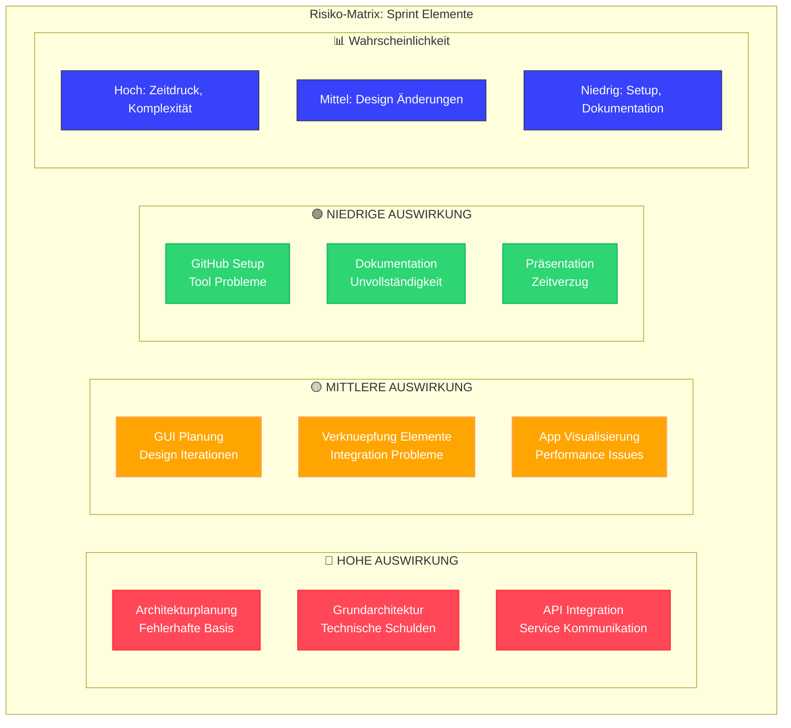
```mermaid
graph TB
    subgraph "Risiko-Matrix: Sprint Elemente"
        subgraph Hoch["🔴 HOHE AUSWIRKUNG"]
            H1["Architekturplanung<br/>Fehlerhafte Basis"]
            H2["Grundarchitektur<br/>Technische Schulden"]
            H3["API Integration<br/>Service Kommunikation"]
        end
        subgraph Mittel["🟡 MITTLERE AUSWIRKUNG"]
            M1["GUI Planung<br/>Design Iterationen"]
            M2["Verknuepfung Elemente<br/>Integration Probleme"]
            M3["App Visualisierung<br/>Performance Issues"]
        end
        subgraph Niedrig["🟢 NIEDRIGE AUSWIRKUNG"]
            N1["GitHub Setup<br/>Tool Probleme"]
            N2["Dokumentation<br/>Unvollständigkeit"]
            N3["Präsentation<br/>Zeitverzug"]
        end
        subgraph Wahrscheinlichkeit["📊 Wahrscheinlichkeit"]
            W1["Hoch: Zeitdruck, Komplexität"]
            W2["Mittel: Design Änderungen"]
            W3["Niedrig: Setup, Dokumentation"]
        end
    end

    classDef hoch fill:#ff4757,stroke:#ff3742,stroke-width:2px,color:#fff
    classDef mittel fill:#ffa502,stroke:#ff9f43,stroke-width:2px,color:#fff
    classDef niedrig fill:#2ed573,stroke:#20bf6b,stroke-width:2px,color:#fff
    classDef info fill:#3742fa,stroke:#2f3542,stroke-width:1px,color:#fff

    class H1,H2,H3 hoch
    class M1,M2,M3 mittel
    class N1,N2,N3 niedrig
    class W1,W2,W3 info
```

Fabrkodierung:
🔴 Hohe Auswirkung (Kritisch)
🟡 Mittlere Auswirkung (Überwachen)
🟢 Niedrige Auswirkung (Akzeptabel)

## 1.4 Risiko-Matrix

Übersicht der Risiken nach Wahrscheinlichkeit und Auswirkung
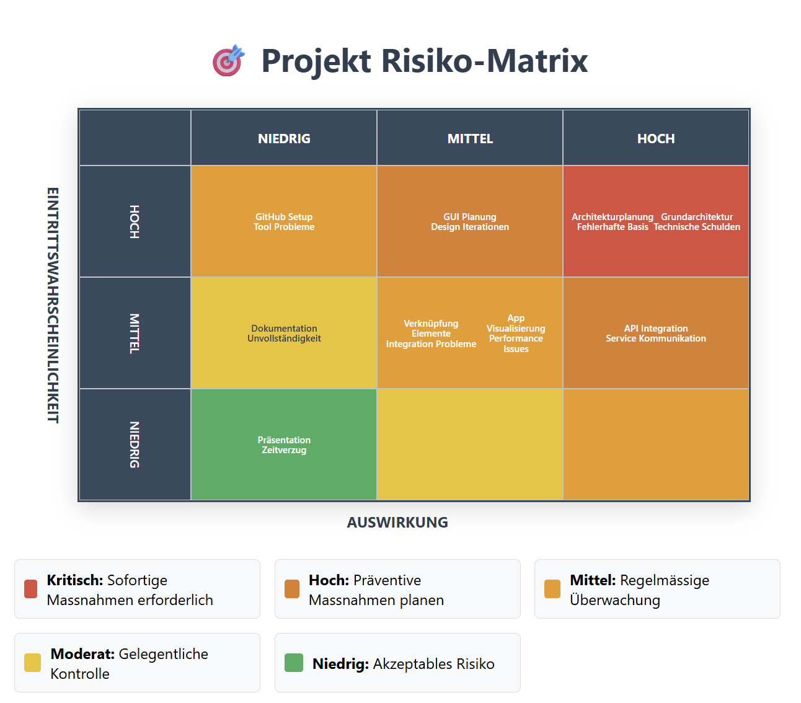

## 1.5 SWOT-Analyse

Stärken, Schwächen, Chancen und Risiken

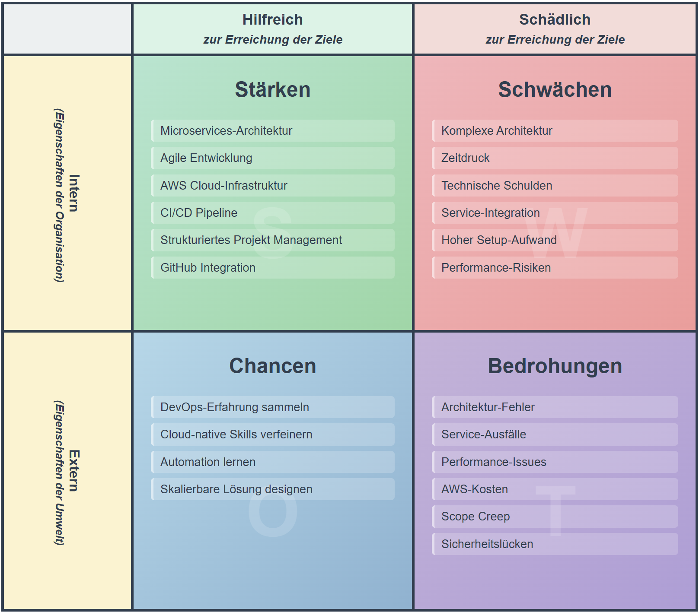

## 1.6 Sprint-Dokumentation

Dokumentation aller Sprint-Aktivitäten inklusive Userstories und Retrospektiven...

### 1.6.1 Sprint 1

# Sprint 1 – Planung & Review

## Zeitraum

5.5. - 9.5.25

## Sprintziel

1. Github – Obsidian setup
2. Architekturplanung
3. Aufbau KanBan Board

## User Stories mit Akzeptanzkriterien

## User Story 1:


| Title:                   | Priority: | Estimate: |
| -------------------------- | ----------- | ----------- |
| Github zu Obsidian Setup | High      | 1h        |

## Beschreibung:

Als Entwickler
Möchte ich **Meinen Text-Editor oder IDE zu meinem Github-Repo verknüpfen**
damit ich **Meine Projektdokumentation festhalten kann**.

## Akzeptanzkriterien:

- Ein verfügbares Repository für die Dokumentation der Semesterarbeit
- Präferierter IDE / Text-Editor welcher aufs Repo zugreifen kann und aktiv änderungen vornimmt

---

## User Story 2:


| Title:             | Priority: | Estimate: |
| -------------------- | ----------- | ----------- |
| Architekturplanung | High      | 2d        |

## Beschreibung:

Als Architekt
Möchte ich **Einen ersten Entwurf meiner Grundarchitektur erstellen**
damit ich **einen ersten Anhaltspunkt zum Architekturdesign habe, an welches sich das Projekt richten kann**.

## Akzeptanzkriterien:

- Ein Mermaid Diagramm mit der groben Vorstellung der Architektur
- Verständliche Beschriftung, Aufbau entsprechend der definierten Sachmittel

---

## User Story 3:


| Title:              | Priority: | Estimate: |
| --------------------- | ----------- | ----------- |
| Aufbau KanBan Board | Medium    | 1d        |

## Beschreibung:

Als Projektleiterin
Möchte ich **Projektvortschritt übersichtlich dokumentieren**
damit ich **meine Stakeholder den Fortschritt mitverfolgen können und ich Übersicht über die Aufgaben behalte**.

## Akzeptanzkriterien:

- Ein verfügbares KanBan Board mit den einzelnen Sprints und deren Ziele
- Die Funktionen Daten zu definieren und Cheklisten in den Zielen aufzubauen

## Aufgabenübersicht Sprint 1


| Aufgabe                  | Status              |
| -------------------------- | --------------------- |
| Github zu Obsidian Setup | Alternativ erledigt |
| Architekturplanung       | erledigt            |
| Aufbau Kan-Ban Board     | erledigt            |

PLANNER FOTO EINFÜGEN

## Sprint Review

### Was wurde erreicht?

- GitHub repo wurde erstellt
- IDE wurde mit GitHub verknüpft - Es wurde auf andere Lösung gewechselt - Da bessere Optionen zur Entwicklung
- Erster Entwurf einer groben Architekturplanung
- KanBan Board wurde erstellt - Microsoft Lists

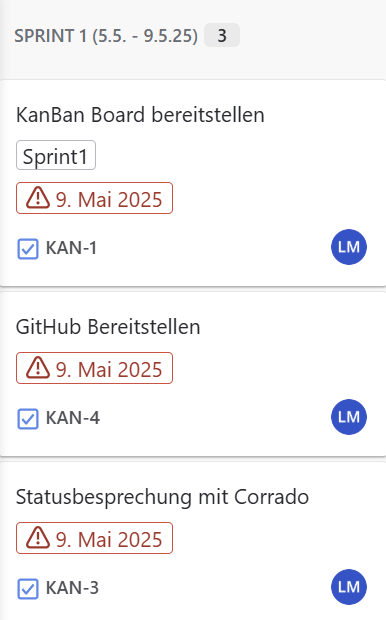
*_KanBan Angfangs Sprint_

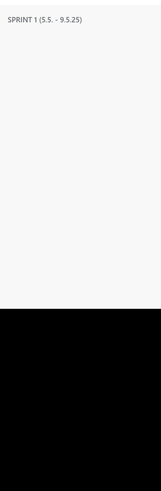
*_KanBan Ende Sprint_

### Herausforderungen

- Microsoft Lists bietet nicht alle benötigten Funktionen an. Es wurde am Anfang des 2. Sprints eine Ausweichmöglichkeit definiert
- Sprint 1 Zeitraum sehr klein

### Lessons Learned

- Mehr Austausch mit den Team-Kollegen und Collaboraters pflegen, um Lösungen zu vergleichen und voneinander zu profitieren. Durch einen Tipp von Teamkollegen, bin ich vollständig auf Visual-Studio gewechselt, da es wesentlich mehr Möglichkeiten anbietet, als Obsidian.

## Ausblick auf Sprint 2

- Wechsel / Migration des KanBan-Board
- Start Entwicklung der Grundarchitektur
- GUI Planung und erste Umsetzun

### 1.6.2 Sprint 2

# Sprint 2 – Planung & Review

## Zeitraum

9.5. - 2.6.25

## Sprintziel

1. Erste Umsetzung und GUI
2. Start Entwicklung der Grundarchitektur
3. Verknüpfung der Elemente, API und Testphase

## User Stories mit Akzeptanzkriterien

## User Story 1:


| Title:                  | Priority: | Estimate: |
| ------------------------- | ----------- | ----------- |
| Erste Umsetzung und GUI | High      | 1h        |

## Beschreibung:

Als Entwickler
Möchte ich **Die Erste Umsetzung der Grundarchitektur Umsetzen**
damit ich **Connectivität zum Fitness-Tracker sicherstellen kann**.

## Akzeptanzkriterien:

- Fehlerfreies herauffahren der Docker-Container
- Ereichbares Frontend mit GUI und dessen Grundfunktionen

---

## User Story 2:


| Title:                                                                           | Priority: | Estimate: |
| ---------------------------------------------------------------------------------- | ----------- | ----------- |
| Verknüpfung der Elemente, Testphase und allenfalls Evaluation von Erweiterungen | High      | 2d        |

## Beschreibung:

Als Architekt
Möchte ich **sicherstellen, das die Container untereinander kommunizieren können und welche Erweiterungen an der Lösung vorgenommen werden können**
damit ich **das Projekt in die Testphase übergeben kann**.

## Akzeptanzkriterien:

- Erreichbarkeit der Container untereinander
- Funktionales Frontend

---

## User Story 3:


| Title:                                                            | Priority: | Estimate: |
| ------------------------------------------------------------------- | ----------- | ----------- |
| Verbesserung der App-Visualisierung und Datenbank-Funktionalität | Medium    | 1d        |

## Beschreibung:

Als Engineer
Möchte ich **Die Visualisierung der App verbessern um eine angenehmeres Benutzererlebnis zu gestalten. **
damit ich **meine User die App nutzen können und persistente Daten auch abrufen können.

## Akzeptanzkriterien:

- Positives Feedback seitens Tester
- Persistenter Datenabruf

## Aufgabenübersicht Sprint 1


| Aufgabe                                                                                           | Status   |
| --------------------------------------------------------------------------------------------------- | ---------- |
| Erste Umsetzung und GUI                                                                           | erledigt |
| Verknüpfung der Elemente, Testphase und allenfalls Evaluation von ErweiterungenArchitekturplanun | erledigt |
| Verbesserung der App-Visualisierung und Datenbank-Funktionalität                                 | erledigt |

PLANNER FOTO EINFÜGEN

## Sprint Review

### Was wurde erreicht?

- Die Tracker-App erreichbarkeit sicherstellen
- Container Verknüpfen und erfolgreich herauffahren
- Erster Entwurf einer groben Architekturplanung
- App GUI attraktiver gestalten mit positivem User-Feedback

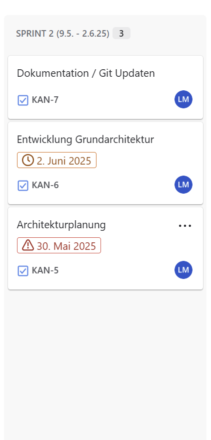
*_KanBan Angfangs Sprint_

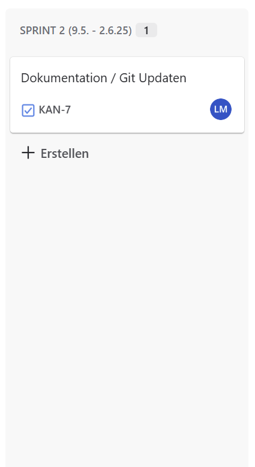
*_KanBan Ende Sprint_


*_Vorgänger der aktuellen Version_


*_Verbessertes Design der Benutzeroberfläche_

### Herausforderungen

- Fitness-Begeisterte tester Finden
- API-Funktionalitäten gewährleisten

### Lessons Learned

## Ausblick auf Sprint 3

- Finale Version des GUI, Statistiken
- API Push Messages sicherstellen
- Übertrag auf AW

### 1.6.3 Sprint 3

Dritte Sprint-Iteration...

## 1.7 Projekterweiterung

Erweiterungen und Anpassungen des ursprünglichen Projektumfangs.

### 1.7.1 Beschrieb zur Projekterweiterung

Detaillierte Beschreibung der Erweiterungen

Da die nötigsten Projektziele vorzeitig erreicht wurden; habe ich zusammen mit Corrado Parisi entschieden, das Projekt zu erweitern um meine Microservice-Kompetenzen optimal zu demonstrieren.

Die Projekterweiterung beinhaltete

- Die Push-Benachrichtigungen-Funktionalität zu de-priorisieren und allfällig zu überspringen
- Die Fitness-Tracker Applikation auf einer EC2 Instanz zur Verfügung zu stellen für die Erreichbarkeit via Internet

Hierbei wurde

- Eine EC2 Inszanz erstellt
- Eine GitHub CI/CD Pipeline erstellt
- Die Pipeline auf ihre Funktionalität getestet

### 1.7.2 SEUSAG-Diagramm - Alte Struktur

Ursprüngliche Systemarchitektur

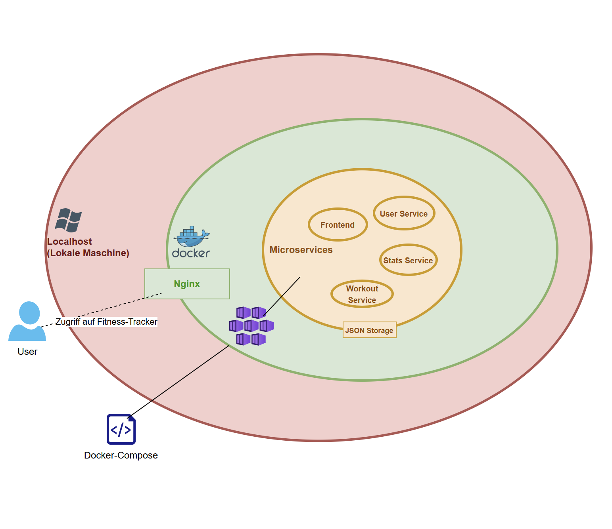

***Aussenwelt:*** Der User greift auf die Nginx Instanz, um die Applikation via Localhost IP-Adresse zu erreichen.

Das Docker Compose wird manuell ausgeführt, um die Docker-Container zu initialisieren

***Rote Schicht:*** Auf dieser Schicht verweilt der Localhost (In diesem Szenario, eine Windows-Maschine)

***Grüne Schicht:*** Auf dieser Schicht operiert Docker;

Docker ist hierbei auf der lokalen Maschine aktiv und (noch) nicht auf der Cloud.

***Gelbe Schicht:***

Hier befinden sich die Container der verschiedenen Microservices der Fitness-Tracker Applikation. Die Informationen der Microservices befinden sich in einem JSON Storage-File.

### 1.7.3 Neue Struktur

Überarbeitete Systemarchitektur

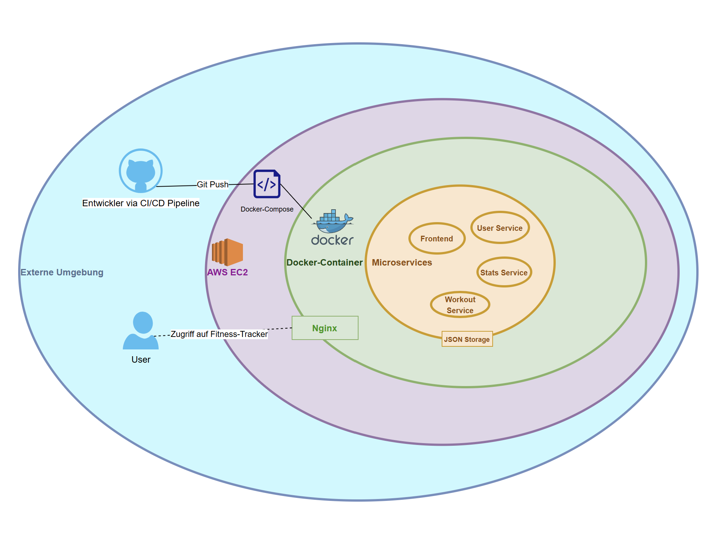

***Blaue Schicht:*** Auf dieser Schicht befindet sich der Entwicker, der via CI/CD Pipeline den Code auf die Lila Schicht pusht.

Der User greift wie gewohnt via Nginx auf die Applikation zu

***Lila Schicht:*** hier befindet sich die Amazon EC2 Instanz

***Grüne Schicht:*** Unterhalb der EC2 Instanz befindet sich die aktive Docker-Applikation

***Gelbe Schicht:*** Hier befinden sich die Mikroservices.

**Wichtige architektonische Verbesserungen:**

1. **Skalierbarkeit** : Von lokaler Maschine zu Cloud-Infrastruktur
2. **Automatisierung** : CI/CD Pipeline für automatische Deployments
3. **Accessibility** : Von localhost zu öffentlich zugänglicher App
4. **Professional Deployment** : Docker-Compose jetzt innerhalb der AWS-Umgebung

**Das zeigt den Übergang von:**

* 🔧**Development** → 🌐**Production**
* 🏠**Local** → ☁️**Cloud**
* 👨‍💻**Manual** → 🤖**Automated**

### 1.7.4 Neue Struktur (Persistent + Weather API)

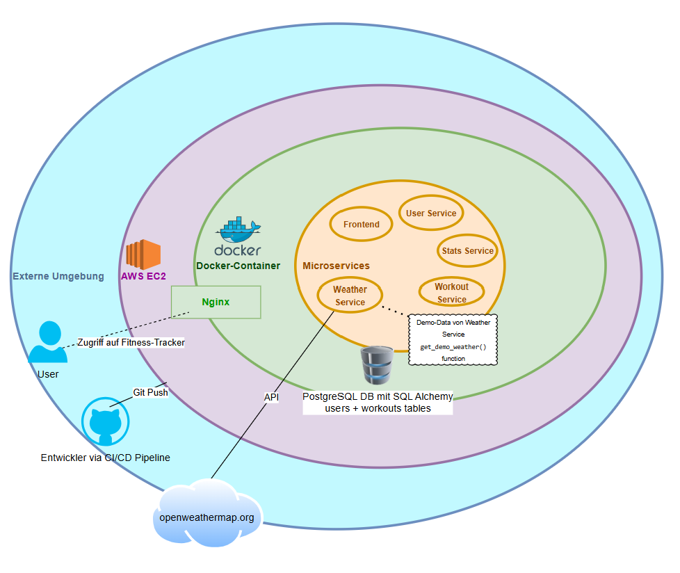

Für bessere/stabilere persistenz innerhalb der Umgebung habe ich mich dazu entschieden, von einem simplen JSON-File als storage-solution für die Daten, zu einer Datenbank zu wechseln.

Dies sind die risiken des JSON-Files:

#### ⚠️ **Weniger robust als echte DBs**

**Risiken deiner File-Lösung:**

* **Corruption** : JSON-File kann bei unvollständigem Write corrumpiert werden
* **No Transactions** : Kein Rollback bei Fehlern
* **Race Conditions** : Gleichzeitige Writes können Daten zerstören

Dies sind die Vorteile der SQL-Migration:

#### **🐘 PostgreSQL Integration:**

* **Von JSON-Files zu echter Datenbank** - Data Persistence
* **SQLAlchemy ORM** - Objekt-relationale Mappings für Python
* **ACID-Transactions** - Datenintegrität und Konsistenz garantiert
* **Foreign Key Relationships** - Users ↔ Workouts Verknüpfungen
* **Performance Optimierung** - SQL-Indexes und Aggregationen

Zudem, wurde für eine vollständige Demonstration für die Kommunikation meiner Microservices in die Aussenwelt, ein ***Weather Microservice*** hinzugefügt:

#### **🌤️ Weather Service Integration:**

* **Neuer Microservice** - Externe API Integration
* **OpenWeatherMap API** - Live Wetter-Daten für Workout-Planung
* **Graceful Degradation / Error Resilience** - Demo-Mode Fallback bei API-Ausfall
* **Personalisierte Empfehlungen** - Workout-Advice basierend auf Wetter

#### **🏗️ Architektur-Verbesserungen:**

* **4 Microservices** statt 3
* **Shared Database** - Konsistente Datenarchitektur
* **External API** - Real-Life Anwendungszweck

## 1.8 Projekt Gantt-Diagramm

Zeitliche Darstellung aller Projektaktivitäten

Dieses Diagramm zeigt die Projekt-Tätigkeiten und dessen Zeitfenster

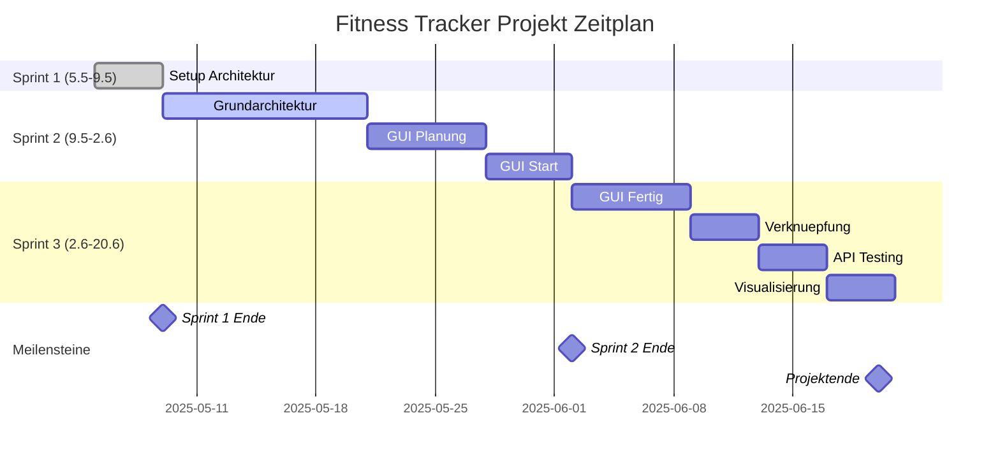
```mermaid
gantt
dateFormat YYYY-MM-DD
title Fitness Tracker Projekt Zeitplan

section Sprint 1 (5.5-9.5)
Setup Architektur :done, s1, 2025-05-05, 4d

section Sprint 2 (9.5-2.6)
Grundarchitektur :active, s2t1, 2025-05-09, 12d
GUI Planung :s2t2, 2025-05-21, 7d
GUI Start :s2t3, 2025-05-28, 5d

section Sprint 3 (2.6-20.6)
GUI Fertig :s3t1, 2025-06-02, 7d
Verknuepfung :s3t2, 2025-06-09, 4d
API Testing :s3t3, 2025-06-13, 4d
Visualisierung :s3t4, 2025-06-17, 4d

section Meilensteine
Sprint 1 Ende :milestone, m1, 2025-05-09, 0d
Sprint 2 Ende :milestone, m2, 2025-06-02, 0d
Projektende :milestone, m3, 2025-06-20, 0d
```

---

# 2. 🛠️ Technische Dokumentation

## 2.1 Architektur-Übersicht

Gesamtarchitektur des Systems


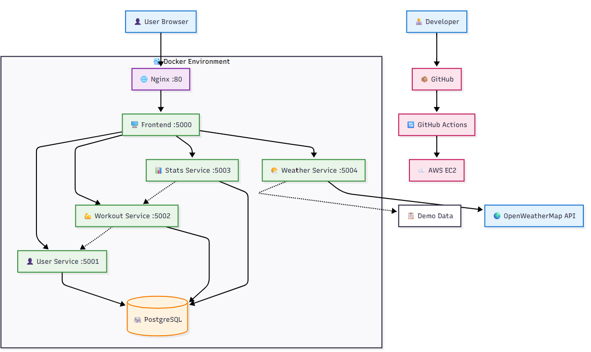

## 2.2 Microservices

**Jeder Service hat eine klare Rolle:**

* 🖥️**Frontend** = UI & Orchestrierung
* 👤**User** = Profile Management
* 💪**Workout** = Exercise Logging
* 📊**Stats** = Analytics & Insights
* 🌤️**Weather** = External Integratio

### 2.2.1 Frontend Service

## 🖥️ Web-Interface und API-Gateway für alle anderen Services

**Port:** 5000 | **Tech:** Flask + Templates + Bootstrap

**Funktionen:**

* User Dashboard mit Workout-Historie
* Responsive UI mit Bootstrap-Design
* Service-übergreifende API-Orchestrierung
* Health-Check Monitoring aller Services

```python
@app.route('/user/<user_id>')
def user_dashboard(user_id):
    user = requests.get(f"{USER_SERVICE_URL}/users/{user_id}")
    workouts = requests.get(f"{WORKOUT_SERVICE_URL}/workouts?user_id={user_id}")
    stats = requests.get(f"{STATS_SERVICE_URL}/stats/{user_id}/summary")
    return render_template('dashboard.html', user=user, workouts=workouts, stats=stats)
```

### 2.2.2 User Service

## 👤 Benutzerverwaltung und Profil-Management

**Port:** 5001 | **Tech:** Flask + SQLAlchemy + PostgreSQL

Funktionen:**

* CRUD-Operationen für User-Profile
* Email-Uniqueness Validation
* User-Authentifizierung Vorbereitung
* Basis für alle anderen Service

```python
@app.route('/users', methods=['POST'])
def create_user():
    data = request.get_json()
    user = User(name=data['name'], email=data['email'], age=data.get('age'))
    db.session.add(user)
    db.session.commit()
    return jsonify(user.to_dict()), 201
```

### 2.2.3 Workout Service

## 💪 Workout-Logging und Exercise-Management

**Port:** 5002 | **Tech:** Flask + SQLAlchemy + PostgreSQL

**Funktionen:**

- Workout-Erfassung (Typ, Dauer, Kalorien)
- User-Validation über User Service
- Foreign Key Relationships zu Users
- Basis-Daten für Statistics Service

```python
@app.route('/workouts', methods=['POST'])
def create_workout():
    data = request.get_json()
    if not verify_user_exists(data['user_id']):
        return jsonify({"error": "User not found"}), 404
  
    workout = Workout(user_id=data['user_id'], exercise_type=data['exercise_type'])
    db.session.add(workout)
    db.session.commit()
    return jsonify(workout.to_dict()), 201
```

### 2.2.4 Stats Service

## 📊 Analytics und Performance-Tracking

**Port:** 5003 | **Tech:** Flask + SQLAlchemy + PostgreSQL

**Funktionen:**

- SQL-Aggregationen für Workout-Statistiken
- Personal Records Tracking
- Weekly/Monthly Trends
- Read-Only Database Access

```python
@app.route('/stats/<user_id>/summary', methods=['GET'])
def get_user_stats_summary(user_id):
    result = db.session.query(
        func.count(Workout.id).label('total_workouts'),
        func.sum(Workout.duration).label('total_duration'),
        func.avg(Workout.calories_burned).label('avg_calories')
    ).filter(Workout.user_id == user_id).first()
  
    return jsonify({
        "total_workouts": result.total_workouts,
        "total_duration": result.total_duration,
        "average_calories": round(float(result.avg_calories or 0), 2)
    })
```

### 2.2.5 Weather Service

## 🌤️ Wetter-basierte Workout-Empfehlungen

**Port:** 5004 | **Tech:** Flask + External API Integration

**Funktionen:**

- OpenWeatherMap API Integration
- Personalisierte Workout-Advice
- Demo-Mode Fallback
- External API Error Handling

```python
@app.route('/weather/workout-advice', methods=['GET'])
def get_workout_advice():
    weather_data = get_current_weather()
  
    if weather_data.get('demo_mode'):
        return jsonify({"advice": "Demo mode - indoor workouts recommended"})
  
    temp = weather_data['temperature']
    if temp > 25:
        advice = "Hot weather - stay hydrated, prefer early morning workouts!"
    elif temp < 5:
        advice = "Cold weather - warm up thoroughly, layer clothing!"
    else:
        advice = "Perfect weather for outdoor activities!"
  
    return jsonify({"advice": advice, "weather": weather_data})
```

# 3. ☁️ Deployment & DevOps

## 3.1 AWS EC2 Setup

Konfiguration der AWS-Infrastruktur:


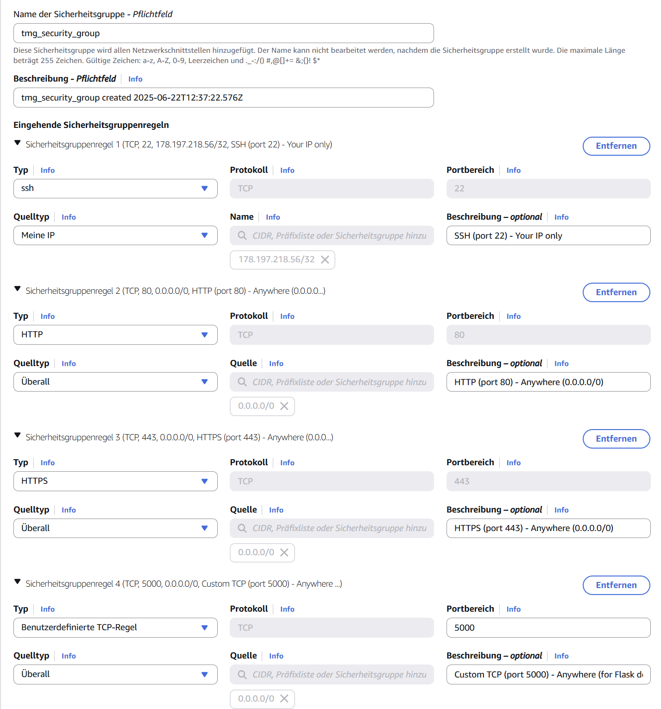


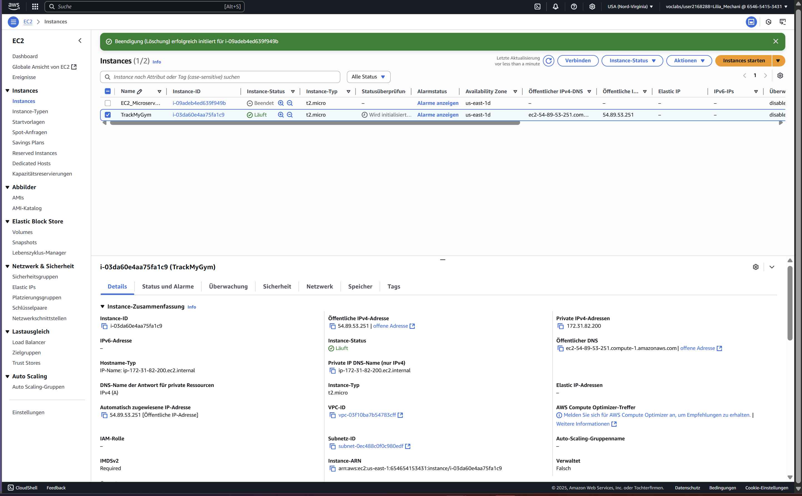


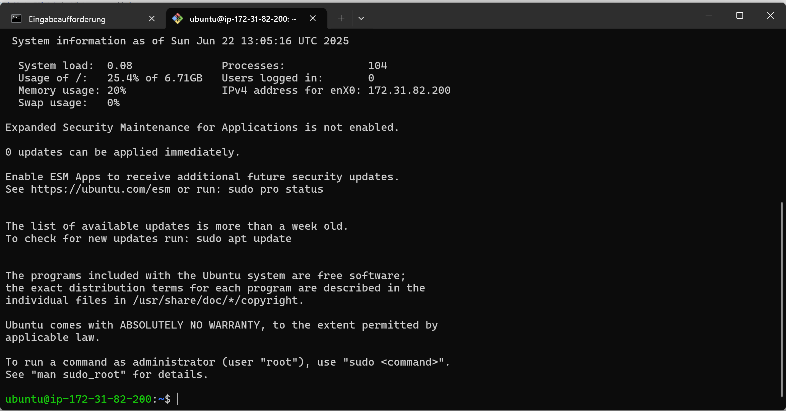


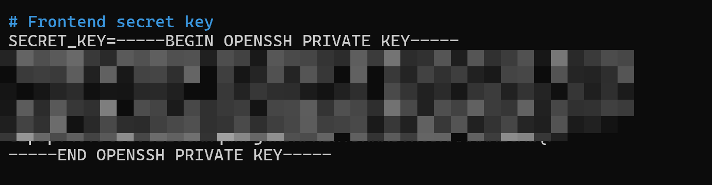


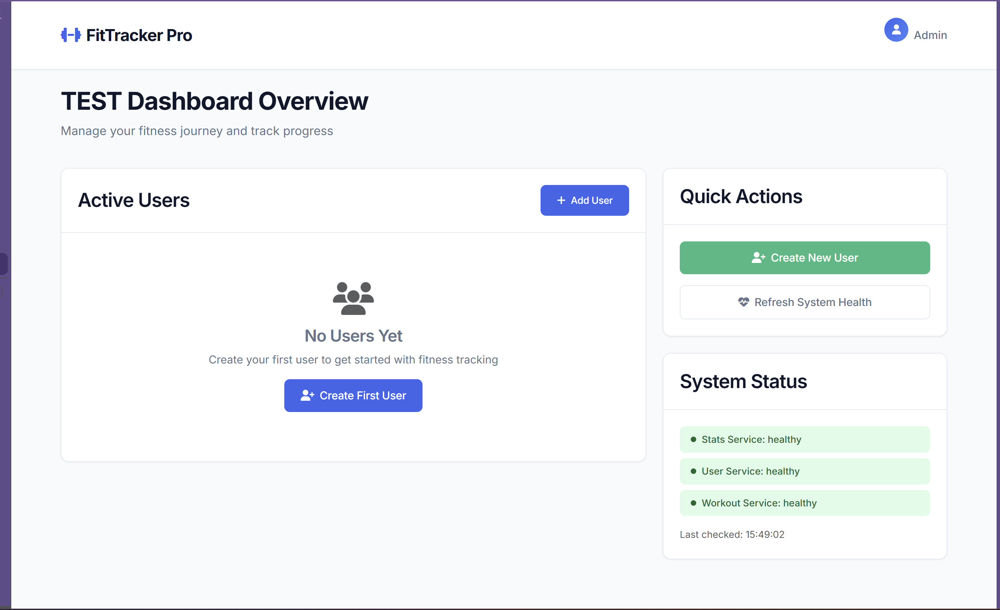


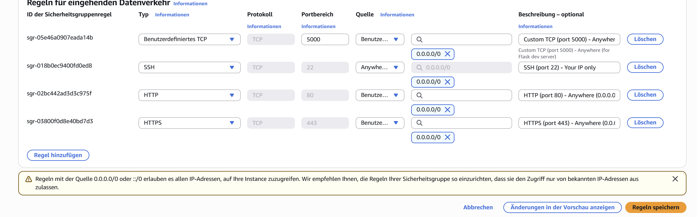


## 3.2 CI/CD Pipeline

#### 🔄 Pipeline Setup GitHub Secrets Config

GitHub Secrets:

**Repository Settings** → **Secrets and Variables** → **Actions**

**Secrets hinzugefügt:**

* `HOST` = EC2 Public IP Address
* `USERNAME` = ubuntu
* `PRIVATE_KEY` = Complete SSH private key (.pem file content)


  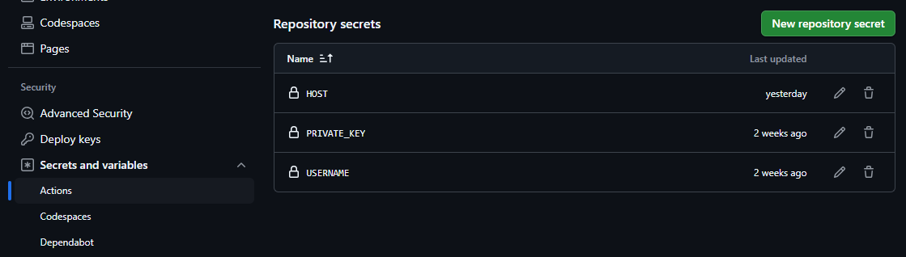

## 3.3 GitHub Actions


**`.github/workflows/deploy.yml`:**

```yaml
name: Deploy TrackMyGym to AWS EC2
on:
  push:
    branches: [ main, master ]
jobs:
  deploy:
    runs-on: ubuntu-latest
    steps:
    - name: Checkout code
      uses: actions/checkout@v3
    - name: Deploy to EC2
      uses: appleboy/ssh-action@v0.1.8
      with:
        host: ${{ secrets.HOST }}
        username: ${{ secrets.USERNAME }}
        key: ${{ secrets.PRIVATE_KEY }}
        script: |
          cd ICTNE24_Semesterarbeit3_L.M
          git pull origin main
          docker-compose down
          docker-compose build --no-cache
          docker-compose up -d
          docker system prune -f
```

**`.github/workflows/pr-check.yml`:**

```yaml
name: PR Health Check
on:
  pull_request:
    branches: [ main, master ]
jobs:
  test:
    runs-on: ubuntu-latest
    steps:
    - name: Checkout code
      uses: actions/checkout@v3
    - name: Build Docker images
      run: docker-compose build
    - name: Test containers start
      run: |
        docker-compose up -d
        sleep 45
        docker-compose ps
        docker-compose down
```


## 3.4 Produktionsumgebung


#### 🛡️Production

Security Group Update:

**Problem** : SSH nur von eigener IP → GitHub Actions kann nicht deployen

**Lösung** : SSH Port 22 auf "Anywhere" (0.0.0.0/0) erweitert

Optimierungen für Produktion:

* **Frontend app.py** : SECRET_KEY aus Environment Variable
* **Docker-compose** : Production Environment Variables
* **No Volumes** : Code in Container images (immutable deployment)
* **Health Checks** : PostgreSQL health checks für Service Dependencies

---

📊 PostgreSQL Migration:

Database Upgrade;

**Von JSON Files zu PostgreSQL:**

* **init.sql** : Database Schema mit Sample Data
* **SQLAlchemy Models** : User & Workout Entities
* **All Services** : Umstellung auf PostgreSQL
* **Requirements.txt** : psycopg2-binary + Flask-SQLAlchemy

Weather Service Integration:

* **Neuer Microservice** : External API Integration
* **OpenWeatherMap API** : Live Weather Data
* **Fallback Strategy** : Demo Data bei API-Ausfall
* **Docker-compose Extension** : weather-service hinzugefüg

---

# 4. 📱 User Interface

## 4.1 Frontend Design

Designkonzept und visuelle Gestaltung

## 4.2 User Experience

Benutzerfreundlichkeit und Usability...

## 4.3 Screenshots

Visuelle Darstellung der Anwendung...

---

# 5. 🧪 Testing & Qualitätssicherung

## 5.1 Pipeline-Testing

Automatisierte Tests in der CI/CD-Pipeline...

## 5.2 User-Testing

Benutzertests und Feedback...

## 5.3 10 Testfälle

Detaillierte Testszenarien und -ergebnisse...

---

# 6. 📈 Ergebnisse & Reflexion

## 6.1 Erreichte Ziele

Zusammenfassung der erfolgreich umgesetzten Projektziele...

## 6.2 Herausforderungen

Schwierigkeiten und Hindernisse während der Entwicklung...

## 6.3 Lessons Learned

Erkenntnisse und Lerneffekte aus dem Projekt...

## 6.4 Ausblick

Zukünftige Entwicklungen und Verbesserungsmöglichkeiten...

---

# 7. 📚 Anhang

## 7.1 Code-Repository

Links zum Quellcode und Repository...

## 7.2 Verwendete Technologien

Übersicht aller eingesetzten Tools und Frameworks...

## 7.3 Quellen

Referenzen und verwendete Literatur...

## 7.4 Glossar

Definitionen wichtiger Begriffe...

## 7.5 Kontaktangaben

Projektteam und Ansprechpartner...

```

```

<style>#mermaid-1751910516117{font-family:"trebuchet ms",verdana,arial;font-size:16px;fill:#ccc;}#mermaid-1751910516117 .error-icon{fill:#a44141;}#mermaid-1751910516117 .error-text{fill:#ddd;stroke:#ddd;}#mermaid-1751910516117 .edge-thickness-normal{stroke-width:2px;}#mermaid-1751910516117 .edge-thickness-thick{stroke-width:3.5px;}#mermaid-1751910516117 .edge-pattern-solid{stroke-dasharray:0;}#mermaid-1751910516117 .edge-pattern-dashed{stroke-dasharray:3;}#mermaid-1751910516117 .edge-pattern-dotted{stroke-dasharray:2;}#mermaid-1751910516117 .marker{fill:lightgrey;}#mermaid-1751910516117 .marker.cross{stroke:lightgrey;}#mermaid-1751910516117 svg{font-family:"trebuchet ms",verdana,arial;font-size:16px;}#mermaid-1751910516117 .label{font-family:"trebuchet ms",verdana,arial;color:#ccc;}#mermaid-1751910516117 .label text{fill:#ccc;}#mermaid-1751910516117 .node rect,#mermaid-1751910516117 .node circle,#mermaid-1751910516117 .node ellipse,#mermaid-1751910516117 .node polygon,#mermaid-1751910516117 .node path{fill:#1f2020;stroke:#81B1DB;stroke-width:1px;}#mermaid-1751910516117 .node .label{text-align:center;}#mermaid-1751910516117 .node.clickable{cursor:pointer;}#mermaid-1751910516117 .arrowheadPath{fill:lightgrey;}#mermaid-1751910516117 .edgePath .path{stroke:lightgrey;stroke-width:1.5px;}#mermaid-1751910516117 .flowchart-link{stroke:lightgrey;fill:none;}#mermaid-1751910516117 .edgeLabel{background-color:hsl(0,0%,34.4117647059%);text-align:center;}#mermaid-1751910516117 .edgeLabel rect{opacity:0.5;background-color:hsl(0,0%,34.4117647059%);fill:hsl(0,0%,34.4117647059%);}#mermaid-1751910516117 .cluster rect{fill:hsl(180,1.5873015873%,28.3529411765%);stroke:rgba(255,255,255,0.25);stroke-width:1px;}#mermaid-1751910516117 .cluster text{fill:#F9FFFE;}#mermaid-1751910516117 div.mermaidTooltip{position:absolute;text-align:center;max-width:200px;padding:2px;font-family:"trebuchet ms",verdana,arial;font-size:12px;background:hsl(20,1.5873015873%,12.3529411765%);border:1px solid rgba(255,255,255,0.25);border-radius:2px;pointer-events:none;z-index:100;}#mermaid-1751910516117:root{--mermaid-font-family:sans-serif;}#mermaid-1751910516117:root{--mermaid-alt-font-family:sans-serif;}#mermaid-1751910516117 flowchart{fill:apa;}</style>
