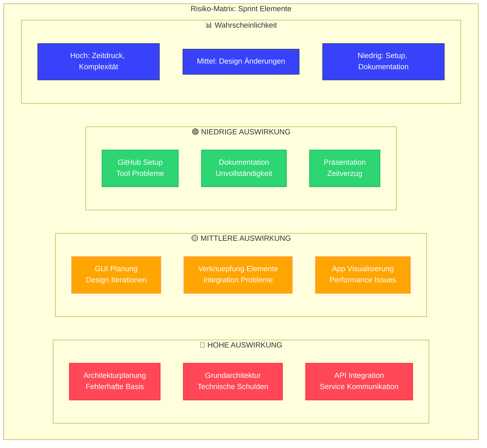
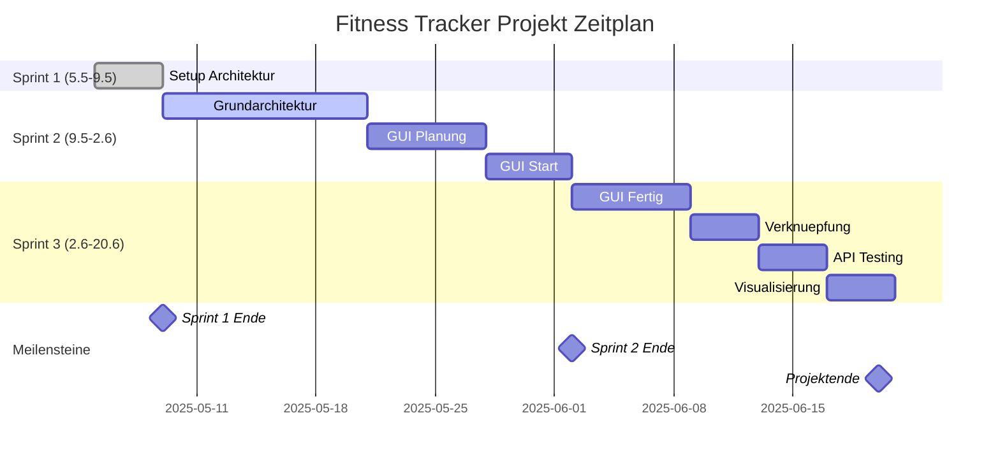

# README

## :page_with_curl: Semesterarbeit 3

| :ticket: Titel:                   | TrackMyGym: Tracke. Wachse. Gewinne.     |
| ----------------------------------- | ------------------------------------------ |
| :bust_in_silhouette: Studierende: | Lilia Mechani                            |
| :busts_in_silhouette: Dozenten:   | (PRJ) Corrado Parisi (MSVC) Boris Langer |

| :round_pushpin: Topics:             |
| ------------------------------------- |
| :computer: Microservices            |
| :paperclip: PRJ (Projektmanagement) |

# TrackMyGym: Tracke. Wachse. Gewinne.

## Inhaltsverzeichnis

## 📋 Projektübersicht
* [Einführung / README](#einführung--readme)
* [Projektinformationen](#projektinformationen)

### [1. 📊 Projektmanagement](#1--projektmanagement)
* [1.1 Projektbeschreibung](#11-projektbeschreibung)
* [1.2 Zeitplan](#12-zeitplan)
* [1.3 Risiko-Evaluation](#13-risiko-evaluation)
* [1.4 Risiko-Matrix](#14-risiko-matrix)
* [1.5 SWOT-Analyse](#15-swot-analyse)
* [1.6 Sprint-Dokumentation](#16-sprint-dokumentation)
  * [1.6.1 Sprint 1](#161-sprint-1)
  * [1.6.2 Sprint 2](#162-sprint-2)
  * [1.6.3 Sprint 3](#163-sprint-3)
* [1.7 Projekterweiterung](#17-projekterweiterung)
  * [1.7.1 Beschrieb zur Projekterweiterung](#171-beschrieb-zur-projekterweiterung)
  * [1.7.2 SEUSAG-Diagramm - Alte Struktur](#172-seusag-diagramm---alte-struktur)
  * [1.7.3 Neue Struktur](#173-neue-struktur)
* [1.8 Projekt Gantt-Diagramm](#18-projekt-gantt-diagramm)

### [2. 🛠️ Technische Dokumentation](#2-️-technische-dokumentation)
* [2.1 Architektur-Übersicht](#21-architektur-übersicht)
* [2.2 Microservices](#22-microservices)
  * [2.2.1 Frontend Service](#221-frontend-service)
  * [2.2.2 User Service](#222-user-service)
  * [2.2.3 Workout Service](#223-workout-service)
  * [2.2.4 Stats Service](#224-stats-service)

### [3. ☁️ Deployment & DevOps](#3-️-deployment--devops)
* [3.1 AWS EC2 Setup](#31-aws-ec2-setup)
* [3.2 CI/CD Pipeline](#32-cicd-pipeline)
* [3.3 GitHub Actions](#33-github-actions)
* [3.4 Produktionsumgebung](#34-produktionsumgebung)

### [4. 📱 User Interface](#4--user-interface)
* [4.1 Frontend Design](#41-frontend-design)
* [4.2 User Experience](#42-user-experience)
* [4.3 Screenshots](#43-screenshots)

### [5. 🧪 Testing & Qualitätssicherung](#5--testing--qualitätssicherung)
* [5.1 Pipeline-Testing](#51-pipeline-testing)
* [5.2 User-Testing](#52-user-testing)
* [5.3 10 Testfälle](#53-10-testfälle)

### [6. 📈 Ergebnisse & Reflexion](#6--ergebnisse--reflexion)
* [6.1 Erreichte Ziele](#61-erreichte-ziele)
* [6.2 Herausforderungen](#62-herausforderungen)
* [6.3 Lessons Learned](#63-lessons-learned)
* [6.4 Ausblick](#64-ausblick)

### [7. 📚 Anhang](#7--anhang)
* [7.1 Code-Repository](#71-code-repository)
* [7.2 Verwendete Technologien](#72-verwendete-technologien)
* [7.3 Quellen](#73-quellen)
* [7.4 Glossar](#74-glossar)
* [7.5 Kontaktangaben](#75-kontaktangaben)

---

## Quick Navigation

* 🚀[Live Demo](platzhalter)
* 💻[GitHub Repository](platzhalter)
* 📊[KanBan Projekt Board](platzhalter)

---

## Einführung / README
Willkommen zum Sprint Elemente Projekt...

## Projektinformationen
Grundlegende Informationen zum Projekt...

---

# 1. 📊 Projektmanagement

## 1.1 Projektbeschreibung
TrackMyGym: Tracke. Wachse. Gewinne.
Projektplanung
TrackMyGym ist eine Fitness-App, mit der Nutzer ihre Gym-Aktivitäten verfolgen können. Die App soll einfach erfassen, wann jemand im Gym war, welche Übungen gemacht wurden und mit welchen Gewichten trainiert wurde.
Die App TrackMyGym soll Benutzer auf mehreren Ebenen motivieren:
Durch Visualisierung des Fortschritts - indem Benutzer ihre Entwicklung über Zeit sehen können, erkennen sie ihre Verbesserungen konkret, was motivierender ist als subjektive Eindrücke
Durch Gewohnheitsbildung - das tägliche Check-in-System schafft eine Routine und macht regelmässige Gym-Besuche zur Gewohnheit
Durch Erfolgsbestätigung - die Dokumentation von steigenden Gewichten oder verbesserten Leistungen liefert messbare Beweise für den Trainingsfortschritt
Durch soziale Aspekte (in späteren Versionen) - Freunde und Gruppen sorgen für Verantwortungsgefühl und gesunden Wettbewerb
Durch Gamification-Elemente wie Leaderboards (In späteren Versionen) - der Vergleich mit anderen schafft zusätzliche Anreize durch freundschaftlichen Wettbewerb

Die App soll auf folgenden Technologien basieren:

- Backend: Python mit Flask (Microservices)
- Deployment: Docker-Container
- API: REST-Schnittstellen (Für motivierende Push-Notifications)

Persönlicher Bezug

Als regelmässiger Gym-Besucher fehlt mir eine einfache App, die meine Fortschritte trackt und gleichzeitig soziale Elemente bietet. TrackMyGym soll genau diese Lücke füllen und mir sowie anderen Fitness-Fans helfen, motiviert zu bleiben
TrackMyGym – Fortschritt messbar machen!

| :checkered_flag: Angezielte Kernfunktionen der App                                        |
| ------------------------------------------------------------------------------------------- |
| Für die erste Beta-Version von TrackMyGym sollte die App folgende Kernfunktionen bieten: |

- Grundlegendes Tracking von Gym-Besuchen (Check-in-System)
- Einfache Erfassung von Übungen und Gewichten
- Individuelle Fortschrittsanzeige für den Nutzer
- Einfache Benutzeroberfläche für die Eingabe und Anzeige der Daten
- Grundlegende Benutzerprofilverwaltung

Die sozialen Funktionen wie Freunde hinzufügen, Gruppenbildung und Leaderboards könnten für spätere Versionen geplant werden, nachdem die Kernfunktionen stabil laufen. Der technische Aufbau mit Python/Flask und Docker-Deployment sollte bereits in der Beta umgesetzt sein.

Weitere optionale Ziele für die App:

- Freunde hinzufügen: Verbindung mit anderen Nutzern
- Gruppen: Bildung von Trainingsgruppen
- Leaderboards: Freundschaftliche Wettkämpfe zwischen Nutzern/Gruppen          |

## 1.2 Zeitplan
Projektzeitleiste und Meilensteine

| Sprint | Arbeitsschritte                                                                          |
| -------- | ------------------------------------------------------------------------------------------ |
| 1      | GitHub–Obsidian Setup, Architekturplanung                                               |
| 3–4   | Start Entwicklung der Grundarchitektur                                                   |
| 2      | GUI-Planung, Erste Umsetzung der GUI                                                     |
| 2      | Verknüpfung der Elemente, API Push-Notifications, Erste Testphase                       |
| 3      | Verbesserung der App-Visualisierung, Statistiken, Abschluss der Datenbankfunktionalität |
| 3      | Vollendung der Dokumentation                                                             |
| 3      | Vorbereitung der Präsentation, Vollendung des Projekts, Abgabe                          |

## 1.3 Risiko-Evaluation
Identifizierte Projektrisiken und deren Bewertung

Um das Risiko des Projektes richtig einschätzen zu können, habe ich untenstehend eine Risiko-Matrix erstellt mit den allfälligen Projekt-Risiken.

Fabrkodierung:
🔴 Hohe Auswirkung (Kritisch)
🟡 Mittlere Auswirkung (Überwachen)
🟢 Niedrige Auswirkung (Akzeptabel)

## 1.4 Risiko-Matrix
Übersicht der Risiken nach Wahrscheinlichkeit und Auswirkung

## 1.5 SWOT-Analyse
Stärken, Schwächen, Chancen und Risiken...

## 1.6 Sprint-Dokumentation
Dokumentation aller Sprint-Aktivitäten inklusive Userstories und Retrospektiven...

### 1.6.1 Sprint 1
Erste Sprint-Iteration...

### 1.6.2 Sprint 2
Zweite Sprint-Iteration...

### 1.6.3 Sprint 3
Dritte Sprint-Iteration...

## 1.7 Projekterweiterung
Erweiterungen und Anpassungen des ursprünglichen Projektumfangs...

### 1.7.1 Beschrieb zur Projekterweiterung
Detaillierte Beschreibung der Erweiterungen

Da die nötigsten Projektziele vorzeitig erreicht wurden; habe ich zusammen mit Corrado Parisi entschieden, das Projekt zu erweitern um meine Microservice-Kompetenzen optimal zu demonstrieren.

Die Projekterweiterung beinhaltete

- Die Push-Benachrichtigungen-Funktionalität zu de-priorisieren und allfällig zu überspringen
- Die Fitness-Tracker Applikation auf einer EC2 Instanz zur Verfügung zu stellen für die Erreichbarkeit via Internet

Hierbei wurde

- Eine EC2 Inszanz erstellt
- Eine GitHub CI/CD Pipeline erstellt
- Die Pipeline auf ihre Funktionalität getestet

### 1.7.2 SEUSAG-Diagramm - Alte Struktur
Ursprüngliche Systemarchitektur

### 1.7.3 Neue Struktur
Überarbeitete Systemarchitektur

**Wichtige architektonische Verbesserungen:**

1. **Skalierbarkeit** : Von lokaler Maschine zu Cloud-Infrastruktur
2. **Automatisierung** : CI/CD Pipeline für automatische Deployments
3. **Accessibility** : Von localhost zu öffentlich zugänglicher App
4. **Professional Deployment** : Docker-Compose jetzt innerhalb der AWS-Umgebung

**Das zeigt den Übergang von:**

* 🔧**Development** → 🌐**Production**
* 🏠**Local** → ☁️**Cloud**
* 👨‍💻**Manual** → 🤖**Automated**

## 1.8 Projekt Gantt-Diagramm
Zeitliche Darstellung aller Projektaktivitäten

Dieses Diagramm zeigt die Projekt-Tätigkeiten und dessen Zeitfenster

---

# 2. 🛠️ Technische Dokumentation

## 2.1 Architektur-Übersicht
Gesamtarchitektur des Systems...

## 2.2 Microservices
Beschreibung der einzelnen Services...

### 2.2.1 Frontend Service
Client-seitige Anwendungslogik...

### 2.2.2 User Service
Benutzerverwaltung und Authentifizierung...

### 2.2.3 Workout Service
Workout-Management und -logik...

### 2.2.4 Stats Service
Statistiken und Auswertungen...

---

# 3. ☁️ Deployment & DevOps

## 3.1 AWS EC2 Setup
Konfiguration der AWS-Infrastruktur...

## 3.2 CI/CD Pipeline
Continuous Integration und Deployment-Prozesse...

## 3.3 GitHub Actions
Automatisierte Workflows und Tests...

## 3.4 Produktionsumgebung
Live-System und Monitoring...

---

# 4. 📱 User Interface

## 4.1 Frontend Design
Designkonzept und visuelle Gestaltung...

## 4.2 User Experience
Benutzerfreundlichkeit und Usability...

## 4.3 Screenshots
Visuelle Darstellung der Anwendung...

---

# 5. 🧪 Testing & Qualitätssicherung

## 5.1 Pipeline-Testing
Automatisierte Tests in der CI/CD-Pipeline...

## 5.2 User-Testing
Benutzertests und Feedback...

## 5.3 10 Testfälle
Detaillierte Testszenarien und -ergebnisse...

---

# 6. 📈 Ergebnisse & Reflexion

## 6.1 Erreichte Ziele
Zusammenfassung der erfolgreich umgesetzten Projektziele...

## 6.2 Herausforderungen
Schwierigkeiten und Hindernisse während der Entwicklung...

## 6.3 Lessons Learned
Erkenntnisse und Lerneffekte aus dem Projekt...

## 6.4 Ausblick
Zukünftige Entwicklungen und Verbesserungsmöglichkeiten...

---

# 7. 📚 Anhang

## 7.1 Code-Repository
Links zum Quellcode und Repository...

## 7.2 Verwendete Technologien
Übersicht aller eingesetzten Tools und Frameworks...

## 7.3 Quellen
Referenzen und verwendete Literatur...

## 7.4 Glossar
Definitionen wichtiger Begriffe...

## 7.5 Kontaktangaben
Projektteam und Ansprechpartner...