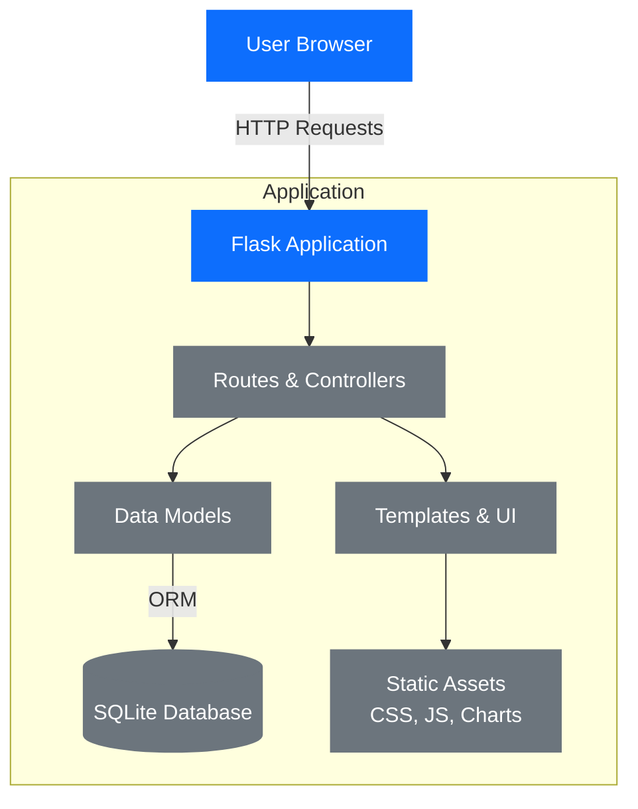

# ICTNE24_Semesterarbeit3_L.M
Semesterarbeit 3
# Einführung / README
## :page_with_curl: Semesterarbeit 3


| :ticket: Titel:                   | TrackMyGym: Tracke. Wachse. Gewinne.  |
| --------------------------------- | ---------------------------------------------------------------- |
| :bust_in_silhouette: Studierende: | Lilia Mechani                                                    |
| :busts_in_silhouette: Dozenten:   | (PRJ) Corrado Parisi (MSVC) Boris Langer                        |

| :round_pushpin: Topics:               |
| ------------------------------------- |
| -  :computer: Microservices                    |
| - :paperclip: PRJ (Projektmanagement) |
|                                       |


## :pencil2: Beschreibung

TrackMyGym: Tracke. Wachse. Gewinne. 
Projektplanung 
TrackMyGym ist eine Fitness-App, mit der Nutzer ihre Gym-Aktivitäten verfolgen können. Die App soll einfach erfassen, wann jemand im Gym war, welche Übungen gemacht wurden und mit welchen Gewichten trainiert wurde. 
Die App TrackMyGym soll Benutzer auf mehreren Ebenen motivieren: 
Durch Visualisierung des Fortschritts - indem Benutzer ihre Entwicklung über Zeit sehen können, erkennen sie ihre Verbesserungen konkret, was motivierender ist als subjektive Eindrücke 
Durch Gewohnheitsbildung - das tägliche Check-in-System schafft eine Routine und macht regelmässige Gym-Besuche zur Gewohnheit 
Durch Erfolgsbestätigung - die Dokumentation von steigenden Gewichten oder verbesserten Leistungen liefert messbare Beweise für den Trainingsfortschritt 
Durch soziale Aspekte (in späteren Versionen) - Freunde und Gruppen sorgen für Verantwortungsgefühl und gesunden Wettbewerb  
Durch Gamification-Elemente wie Leaderboards (In späteren Versionen) - der Vergleich mit anderen schafft zusätzliche Anreize durch freundschaftlichen Wettbewerb 

 

Technischer Aufbau 

Die App soll auf folgenden Technologien basieren: 

- Backend: Python mit Flask (Microservices) 
- Deployment: Docker-Container 
- API: REST-Schnittstellen (Für motivierende Push-Notifications) 

 

Persönlicher Bezug 

Als regelmässiger Gym-Besucher fehlt mir eine einfache App, die meine Fortschritte trackt und gleichzeitig soziale Elemente bietet. TrackMyGym soll genau diese Lücke füllen und mir sowie anderen Fitness-Fans helfen, motiviert zu bleiben 
TrackMyGym – Fortschritt messbar machen! 


| :checkered_flag: Ziele                                                                                 |
| ------------------------------------------------------------------------------------------------------ |
Für die erste Beta-Version von TrackMyGym sollte die App folgende Kernfunktionen bieten: 

Grundlegendes Tracking von Gym-Besuchen (Check-in-System) 

Einfache Erfassung von Übungen und Gewichten 

Individuelle Fortschrittsanzeige für den Nutzer 

Einfache Benutzeroberfläche für die Eingabe und Anzeige der Daten 

Grundlegende Benutzerprofilverwaltung 

Die sozialen Funktionen wie Freunde hinzufügen, Gruppenbildung und Leaderboards könnten für spätere Versionen geplant werden, nachdem die Kernfunktionen stabil laufen. Der technische Aufbau mit Python/Flask und Docker-Deployment sollte bereits in der Beta umgesetzt sein.  

Weitere optionale Ziele für die App: 

- Freunde hinzufügen: Verbindung mit anderen Nutzern 

- Gruppen: Bildung von Trainingsgruppen 

- Leaderboards: Freundschaftliche Wettkämpfe zwischen Nutzern/Gruppen          |


## Zeitplan

| Woche     | Arbeitsschritte                                                                 |
|-----------|----------------------------------------------------------------------------------|
| 1–2       | GitHub–Obsidian Setup, Architekturplanung                                       |
| 3–4       | Start Entwicklung der Grundarchitektur                                          |
| 5–6       | GUI-Planung, Erste Umsetzung der GUI                                            |
| 7–8       | Verknüpfung der Elemente, API Push-Notifications, Erste Testphase               |
| 9–10      | Verbesserung der App-Visualisierung, Statistiken, Abschluss der Datenbankfunktionalität |
| 11        | Vollendung der Dokumentation                                                    |
| 12        | Vorbereitung der Präsentation, Vollendung des Projekts, Abgabe                  |




# Projekt Gantt-Diagramm

```mermaid
gantt
dateFormat YYYY-MM-DD
title Fitness Tracker Projekt Zeitplan

section Woche 1-2
Github Setup :done, w1, 2025-05-05, 7d
Architektur :done, w2, 2025-05-12, 7d

section Woche 3-4
Grundarch Start :active, w3, 2025-05-19, 7d
Grundarch :w4, 2025-05-26, 7d

section Woche 5-6
GUI Plan :w5, 2025-06-02, 7d
GUI Umsetz :w6, 2025-06-09, 7d

section Woche 7-8
Verknuepfung :w7, 2025-06-16, 7d
API Test :w8, 2025-06-23, 7d

section Woche 9-10
Visualisierung :w9, 2025-06-30, 7d
Statistiken :w10, 2025-07-07, 7d

section Woche 11
Dokumentation :w11, 2025-07-14, 7d

section Woche 12
Praesentation :w12, 2025-07-21, 7d

section Sprint Meilensteine
Sprint 1 Ende :milestone, s1, 2025-05-09, 0d
Sprint 2 Ende :milestone, s2, 2025-06-02, 0d
Sprint 3 Ende :milestone, s3, 2025-06-20, 0d