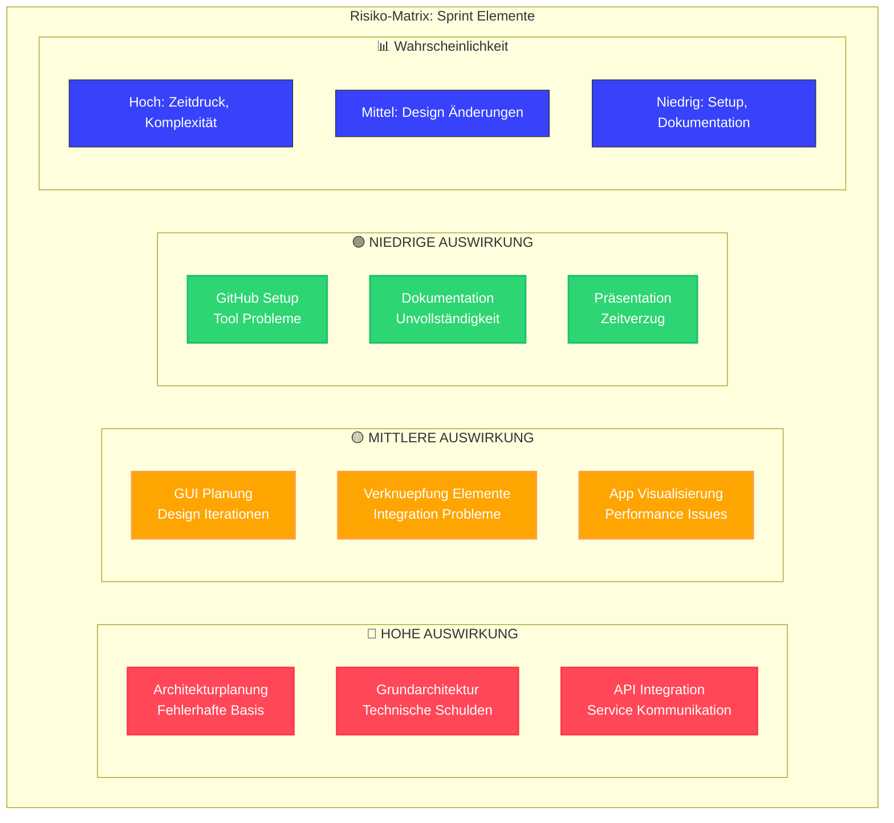
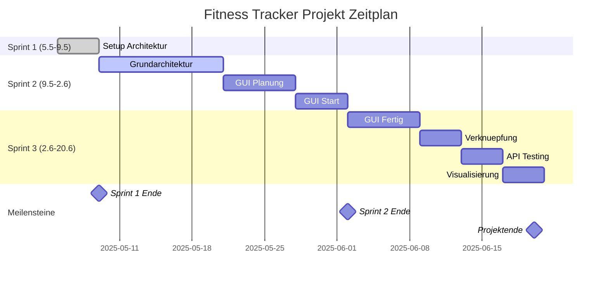

# ICTNE24_Semesterarbeit3_L.M

Semesterarbeit 3

# Einführung / README

## :page_with_curl: Semesterarbeit 3

| :ticket: Titel:                   | TrackMyGym: Tracke. Wachse. Gewinne.     |
| ----------------------------------- | ------------------------------------------ |
| :bust_in_silhouette: Studierende: | Lilia Mechani                            |
| :busts_in_silhouette: Dozenten:   | (PRJ) Corrado Parisi (MSVC) Boris Langer |

| :round_pushpin: Topics:              |
| -------------------------------------- |
| -:computer: Microservices            |
| -:paperclip: PRJ (Projektmanagement) |
|                                      |

## :pencil2: Beschreibung

TrackMyGym: Tracke. Wachse. Gewinne.
Projektplanung
TrackMyGym ist eine Fitness-App, mit der Nutzer ihre Gym-Aktivitäten verfolgen können. Die App soll einfach erfassen, wann jemand im Gym war, welche Übungen gemacht wurden und mit welchen Gewichten trainiert wurde.
Die App TrackMyGym soll Benutzer auf mehreren Ebenen motivieren:
Durch Visualisierung des Fortschritts - indem Benutzer ihre Entwicklung über Zeit sehen können, erkennen sie ihre Verbesserungen konkret, was motivierender ist als subjektive Eindrücke
Durch Gewohnheitsbildung - das tägliche Check-in-System schafft eine Routine und macht regelmässige Gym-Besuche zur Gewohnheit
Durch Erfolgsbestätigung - die Dokumentation von steigenden Gewichten oder verbesserten Leistungen liefert messbare Beweise für den Trainingsfortschritt
Durch soziale Aspekte (in späteren Versionen) - Freunde und Gruppen sorgen für Verantwortungsgefühl und gesunden Wettbewerb
Durch Gamification-Elemente wie Leaderboards (In späteren Versionen) - der Vergleich mit anderen schafft zusätzliche Anreize durch freundschaftlichen Wettbewerb

Technischer Aufbau

Die App soll auf folgenden Technologien basieren:

- Backend: Python mit Flask (Microservices)
- Deployment: Docker-Container
- API: REST-Schnittstellen (Für motivierende Push-Notifications)

Persönlicher Bezug

Als regelmässiger Gym-Besucher fehlt mir eine einfache App, die meine Fortschritte trackt und gleichzeitig soziale Elemente bietet. TrackMyGym soll genau diese Lücke füllen und mir sowie anderen Fitness-Fans helfen, motiviert zu bleiben
TrackMyGym – Fortschritt messbar machen!

| :checkered_flag: Ziele                                                                    |
| ------------------------------------------------------------------------------------------- |
| Für die erste Beta-Version von TrackMyGym sollte die App folgende Kernfunktionen bieten: |

Grundlegendes Tracking von Gym-Besuchen (Check-in-System)

Einfache Erfassung von Übungen und Gewichten

Individuelle Fortschrittsanzeige für den Nutzer

Einfache Benutzeroberfläche für die Eingabe und Anzeige der Daten

Grundlegende Benutzerprofilverwaltung

Die sozialen Funktionen wie Freunde hinzufügen, Gruppenbildung und Leaderboards könnten für spätere Versionen geplant werden, nachdem die Kernfunktionen stabil laufen. Der technische Aufbau mit Python/Flask und Docker-Deployment sollte bereits in der Beta umgesetzt sein.

Weitere optionale Ziele für die App:

- Freunde hinzufügen: Verbindung mit anderen Nutzern
- Gruppen: Bildung von Trainingsgruppen
- Leaderboards: Freundschaftliche Wettkämpfe zwischen Nutzern/Gruppen          |

## Zeitplan

| Sprint | Arbeitsschritte                                                                          |
| -------- | ------------------------------------------------------------------------------------------ |
| 1      | GitHub–Obsidian Setup, Architekturplanung                                               |
| 3–4   | Start Entwicklung der Grundarchitektur                                                   |
| 2      | GUI-Planung, Erste Umsetzung der GUI                                                     |
| 2      | Verknüpfung der Elemente, API Push-Notifications, Erste Testphase                       |
| 3      | Verbesserung der App-Visualisierung, Statistiken, Abschluss der Datenbankfunktionalität |
| 3      | Vollendung der Dokumentation                                                             |
| 3      | Vorbereitung der Präsentation, Vollendung des Projekts, Abgabe                          |

## Risiko-Matrix
Um das Risiko des Projektes richtig einschätzen zu können, habe ich untenstehend eine Risiko-Matrix erstellt mit den allfälligen Projekt-Risiken.

## Projekt Gantt-Diagramm

Dieses Diagramm zeigt die Projekt-Tätigkeiten und dessen Zeitfenster

