# README

## :page_with_curl: Semesterarbeit 3

| :ticket: Titel:                   | TrackMyGym: Tracke. Wachse. Gewinne.     |
| ----------------------------------- | ------------------------------------------ |
| :bust_in_silhouette: Studierende: | Lilia Mechani                            |
| :busts_in_silhouette: Dozenten:   | (PRJ) Corrado Parisi (MSVC) Boris Langer |

| :round_pushpin: Topics:             |
| ------------------------------------- |
| :computer: Microservices            |
| :paperclip: PRJ (Projektmanagement) |
|                                     |

# TrackMyGym: Tracke. Wachse. Gewinne.

## Inhaltsverzeichnis

### 📋 Projektübersicht

* [Einführung / README](platzhalter)
* [Projektinformationen](platzhalter)

### 1. 📊 Projektmanagement

* [1.1 Projektbeschreibung](platzhalter)
* [1.2 Zeitplan](platzhalter)
* [1.3 Risiko-Evaluation](platzhalter)
* [1.4 Risiko-Matrix](platzhalter)
* 1.5 SWOT-Analyse
* [1.6 Sprint-Dokumentation](platzhalter) + Userstories / Retros
  * [1.6.1 Sprint 1](platzhalter)
  * [1.6.2 Sprint 2](platzhalter)
  * [1.6.3 Sprint 3](platzhalter)
* [1.7 Projekterweiterung](platzhalter)
  * [1.7.1 Beschrieb zur Projekterweiterung](platzhalter)
  * [1.7.2 SEUSAG-Diagramm - Alte Struktur](platzhalter)
  * [1.7.3 Neue Struktur](platzhalter)
* [1.8 Projekt Gantt-Diagramm](platzhalter)

### 2. 🛠️ Technische Dokumentation

* [2.1 Architektur-Übersicht](platzhalter)
* [2.2 Microservices](platzhalter)

  * Frontend Service
  * User Service
  * Workout Service
  * Stats Service

### 3. ☁️ Deployment & DevOps

* [3.1 AWS EC2 Setup](platzhalter)
* [3.2 CI/CD Pipeline](platzhalter)
* [3.3 GitHub Actions](platzhalter)
* [3.4 Produktionsumgebung](platzhalter)

### 4. 📱 User Interface

* [4.1 Frontend Design](platzhalter)
* [4.2 User Experience](platzhalter)
* [4.3 Screenshots](platzhalter)

### 5. 🧪 Testing & Qualitätssicherung

* [5.1 Pipeline-Testing](platzhalter)
* [5.2 User-Testing](platzhalter)
* 5.3 10 Testfälle

### 6. 📈 Ergebnisse & Reflexion

* [6.1 Erreichte Ziele](platzhalter)
* [6.2 Herausforderungen](platzhalter)
* [6.3 Lessons Learned](platzhalter)
* [6.4 Ausblick](platzhalter)

### 7. 📚 Anhang

* [7.1 Code-Repository](platzhalter)
* [7.2 Verwendete Technologien](platzhalter)
* [7.3 Quellen](platzhalter)

---

## Quick Navigation

* 🚀[Live Demo](platzhalter)
* 💻[GitHub Repository](platzhalter)
* 📊[KanBan Projekt Board](platzhalter)

# 1. Projektmanagement

## :pencil2: 1.1 Projektbeschreibung

TrackMyGym: Tracke. Wachse. Gewinne.
Projektplanung
TrackMyGym ist eine Fitness-App, mit der Nutzer ihre Gym-Aktivitäten verfolgen können. Die App soll einfach erfassen, wann jemand im Gym war, welche Übungen gemacht wurden und mit welchen Gewichten trainiert wurde.
Die App TrackMyGym soll Benutzer auf mehreren Ebenen motivieren:
Durch Visualisierung des Fortschritts - indem Benutzer ihre Entwicklung über Zeit sehen können, erkennen sie ihre Verbesserungen konkret, was motivierender ist als subjektive Eindrücke
Durch Gewohnheitsbildung - das tägliche Check-in-System schafft eine Routine und macht regelmässige Gym-Besuche zur Gewohnheit
Durch Erfolgsbestätigung - die Dokumentation von steigenden Gewichten oder verbesserten Leistungen liefert messbare Beweise für den Trainingsfortschritt
Durch soziale Aspekte (in späteren Versionen) - Freunde und Gruppen sorgen für Verantwortungsgefühl und gesunden Wettbewerb
Durch Gamification-Elemente wie Leaderboards (In späteren Versionen) - der Vergleich mit anderen schafft zusätzliche Anreize durch freundschaftlichen Wettbewerb

Technischer Aufbau

Die App soll auf folgenden Technologien basieren:

- Backend: Python mit Flask (Microservices)
- Deployment: Docker-Container
- API: REST-Schnittstellen (Für motivierende Push-Notifications)

Persönlicher Bezug

Als regelmässiger Gym-Besucher fehlt mir eine einfache App, die meine Fortschritte trackt und gleichzeitig soziale Elemente bietet. TrackMyGym soll genau diese Lücke füllen und mir sowie anderen Fitness-Fans helfen, motiviert zu bleiben
TrackMyGym – Fortschritt messbar machen!

| :checkered_flag: Angezielte Kernfunktionen der App                                        |
| ------------------------------------------------------------------------------------------- |
| Für die erste Beta-Version von TrackMyGym sollte die App folgende Kernfunktionen bieten: |

- Grundlegendes Tracking von Gym-Besuchen (Check-in-System)
- Einfache Erfassung von Übungen und Gewichten
- Individuelle Fortschrittsanzeige für den Nutzer
- Einfache Benutzeroberfläche für die Eingabe und Anzeige der Daten
- Grundlegende Benutzerprofilverwaltung

Die sozialen Funktionen wie Freunde hinzufügen, Gruppenbildung und Leaderboards könnten für spätere Versionen geplant werden, nachdem die Kernfunktionen stabil laufen. Der technische Aufbau mit Python/Flask und Docker-Deployment sollte bereits in der Beta umgesetzt sein.

Weitere optionale Ziele für die App:

- Freunde hinzufügen: Verbindung mit anderen Nutzern
- Gruppen: Bildung von Trainingsgruppen
- Leaderboards: Freundschaftliche Wettkämpfe zwischen Nutzern/Gruppen          |

## 1.2 Zeitplan

| Sprint | Arbeitsschritte                                                                          |
| -------- | ------------------------------------------------------------------------------------------ |
| 1      | GitHub–Obsidian Setup, Architekturplanung                                               |
| 3–4   | Start Entwicklung der Grundarchitektur                                                   |
| 2      | GUI-Planung, Erste Umsetzung der GUI                                                     |
| 2      | Verknüpfung der Elemente, API Push-Notifications, Erste Testphase                       |
| 3      | Verbesserung der App-Visualisierung, Statistiken, Abschluss der Datenbankfunktionalität |
| 3      | Vollendung der Dokumentation                                                             |
| 3      | Vorbereitung der Präsentation, Vollendung des Projekts, Abgabe                          |

## 1.3 Risiko-Evaluation

Um das Risiko des Projektes richtig einschätzen zu können, habe ich untenstehend eine Risiko-Matrix erstellt mit den allfälligen Projekt-Risiken.

```mermaid
graph TB
    subgraph "Risiko-Matrix: Sprint Elemente"
        subgraph Hoch["🔴 HOHE AUSWIRKUNG"]
            H1["Architekturplanung<br/>Fehlerhafte Basis"]
            H2["Grundarchitektur<br/>Technische Schulden"]
            H3["API Integration<br/>Service Kommunikation"]
        end
        subgraph Mittel["🟡 MITTLERE AUSWIRKUNG"]
            M1["GUI Planung<br/>Design Iterationen"]
            M2["Verknuepfung Elemente<br/>Integration Probleme"]
            M3["App Visualisierung<br/>Performance Issues"]
        end
        subgraph Niedrig["🟢 NIEDRIGE AUSWIRKUNG"]
            N1["GitHub Setup<br/>Tool Probleme"]
            N2["Dokumentation<br/>Unvollständigkeit"]
            N3["Präsentation<br/>Zeitverzug"]
        end
        subgraph Wahrscheinlichkeit["📊 Wahrscheinlichkeit"]
            W1["Hoch: Zeitdruck, Komplexität"]
            W2["Mittel: Design Änderungen"]
            W3["Niedrig: Setup, Dokumentation"]
        end
    end

    classDef hoch fill:#ff4757,stroke:#ff3742,stroke-width:2px,color:#fff
    classDef mittel fill:#ffa502,stroke:#ff9f43,stroke-width:2px,color:#fff
    classDef niedrig fill:#2ed573,stroke:#20bf6b,stroke-width:2px,color:#fff
    classDef info fill:#3742fa,stroke:#2f3542,stroke-width:1px,color:#fff

    class H1,H2,H3 hoch
    class M1,M2,M3 mittel
    class N1,N2,N3 niedrig
    class W1,W2,W3 info
```

Fabrkodierung:
🔴 Hohe Auswirkung (Kritisch)
🟡 Mittlere Auswirkung (Überwachen)
🟢 Niedrige Auswirkung (Akzeptabel)

## 1.4 Risiko-Matrix

## 1.5 Projekterweiterung

### 1.5.1 Beschrieb zur Projekterweiterung

Da die nötigsten Projektziele vorzeitig erreicht wurden; habe ich zusammen mit Corrado Parisi entschieden, das Projekt zu erweitern um meine Microservice-Kompetenzen optimal zu demonstrieren.

Die Projekterweiterung beinhaltete

- Die Push-Benachrichtigungen-Funktionalität zu de-priorisieren und allfällig zu überspringen
- Die Fitness-Tracker Applikation auf einer EC2 Instanz zur Verfügung zu stellen für die Erreichbarkeit via Internet

Hierbei wurde

- Eine EC2 Inszanz erstellt
- Eine GitHub CI/CD Pipeline erstellt
- Die Pipeline auf ihre Funktionalität getestet

### 1.5.2 SEUSAG-Diagramm

## Alte Struktur

## 1.5.3 Neue Struktur

**Wichtige architektonische Verbesserungen:**

1. **Skalierbarkeit** : Von lokaler Maschine zu Cloud-Infrastruktur
2. **Automatisierung** : CI/CD Pipeline für automatische Deployments
3. **Accessibility** : Von localhost zu öffentlich zugänglicher App
4. **Professional Deployment** : Docker-Compose jetzt innerhalb der AWS-Umgebung

**Das zeigt den Übergang von:**

* 🔧**Development** → 🌐**Production**
* 🏠**Local** → ☁️**Cloud**
* 👨‍💻**Manual** → 🤖**Automated**

## 1.6 Projekt Gantt-Diagramm

Dieses Diagramm zeigt die Projekt-Tätigkeiten und dessen Zeitfenster

