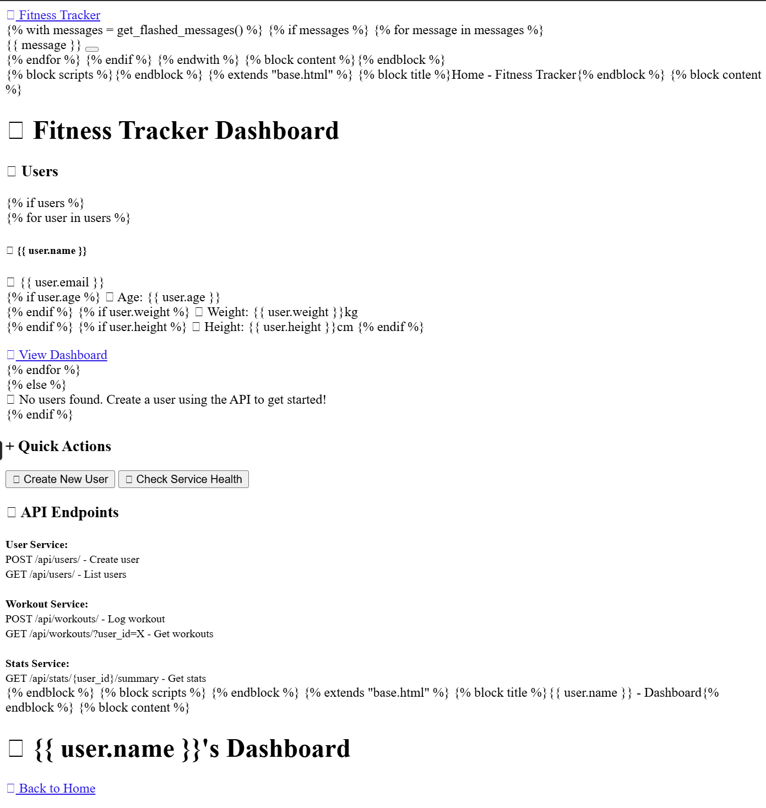
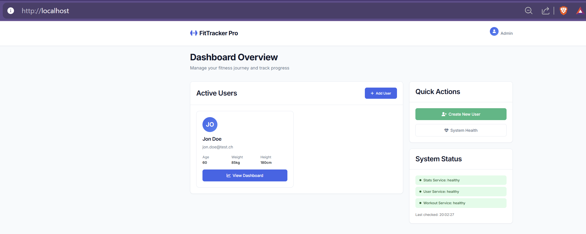

# Sprint 2 – Planung & Review

## Zeitraum

9.5. - 2.6.25

## Sprintziel

1. Erste Umsetzung und GUI
2. Start Entwicklung der Grundarchitektur
3. Verknüpfung der Elemente, API und Testphase

## User Stories mit Akzeptanzkriterien

## User Story 1:

| Title:                  | Priority: | Estimate: |
| ------------------------- | ----------- | ----------- |
| Erste Umsetzung und GUI | High      | 1h        |

## Beschreibung:

Als Entwickler
Möchte ich **Die Erste Umsetzung der Grundarchitektur Umsetzen**
damit ich **Connectivität zum Fitness-Tracker sicherstellen kann**.

## Akzeptanzkriterien:

- Fehlerfreies herauffahren der Docker-Container
- Ereichbares Frontend mit GUI und dessen Grundfunktionen

---

## User Story 2:

| Title:                                                                           | Priority: | Estimate: |
| ---------------------------------------------------------------------------------- | ----------- | ----------- |
| Verknüpfung der Elemente, Testphase und allenfalls Evaluation von Erweiterungen | High      | 2d        |

## Beschreibung:

Als Architekt
Möchte ich **sicherstellen, das die Container untereinander kommunizieren können und welche Erweiterungen an der Lösung vorgenommen werden können**
damit ich **das Projekt in die Testphase übergeben kann**.

## Akzeptanzkriterien:

- Erreichbarkeit der Container untereinander
- Funktionales Frontend

---

## User Story 3:

| Title:                                                            | Priority: | Estimate: |
| ------------------------------------------------------------------- | ----------- | ----------- |
| Verbesserung der App-Visualisierung und Datenbank-Funktionalität | Medium    | 1d        |

## Beschreibung:

Als Engineer
Möchte ich **Die Visualisierung der App verbessern um eine angenehmeres Benutzererlebnis zu gestalten. **
damit ich **meine User die App nutzen können und persistente Daten auch abrufen können.

## Akzeptanzkriterien:

- Positives Feedback seitens Tester
- Persistenter Datenabruf

## Aufgabenübersicht Sprint 1

| Aufgabe                                                                                           | Status   |
| --------------------------------------------------------------------------------------------------- | ---------- |
| Erste Umsetzung und GUI                                                                           | erledigt |
| Verknüpfung der Elemente, Testphase und allenfalls Evaluation von ErweiterungenArchitekturplanun | erledigt |
| Verbesserung der App-Visualisierung und Datenbank-Funktionalität                                 | erledigt |

PLANNER FOTO EINFÜGEN

## Sprint Review

### Was wurde erreicht?

- Die Tracker-App erreichbarkeit sicherstellen
- Container Verknüpfen und erfolgreich herauffahren
- Erster Entwurf einer groben Architekturplanung
- App GUI attraktiver gestalten mit positivem User-Feedback

*_Vorgänger der aktuellen Version_

*_Verbessertes Design der Benutzeroberfläche_

### Herausforderungen

- Fitness-Begeisterte tester Finden
- API-Funktionalitäten gewährleisten

### Lessons Learned

## Ausblick auf Sprint 3

- Finale Version des GUI, Statistiken
- API Push Messages sicherstellen
- Übertrag auf AWS
