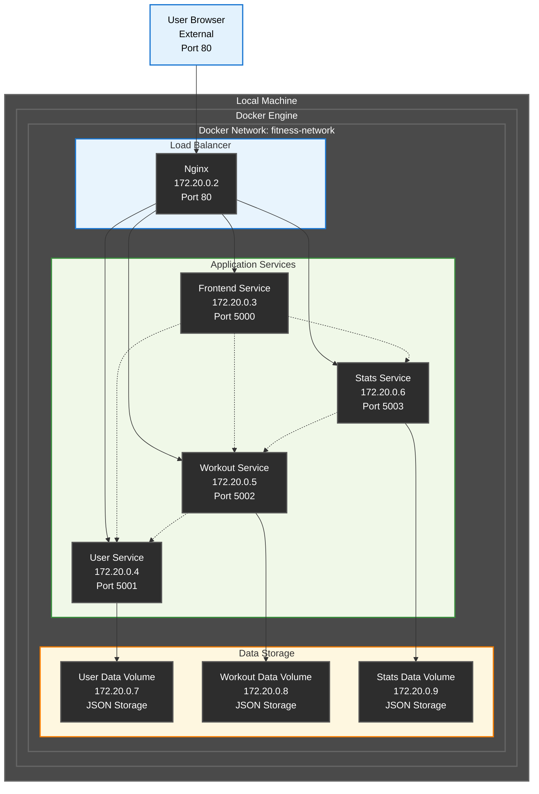

# Sprint 2 – Planung & Review

## Zeitraum

9.5. - 2.6.25

## Sprintziel

1. Wechsel / Migration des KanBan-Board
2. Start Entwicklung der Grundarchitektur
3. GUI Planung und erste Umsetzung

## User Stories mit Akzeptanzkriterien

## User Story 2:

| Title:                              | Priority: | Estimate: |
| ------------------------------------- | ----------- | ----------- |
| Wechsel / Migraton des KanBan Board | High      | 1h        |

## Beschreibung:

Als Entwickler
Möchte ich **Meinen Text-Editor oder IDE zu meinem Github-Repo verknüpfen**
damit ich **Meine Projektdokumentation festhalten kann**.

## Akzeptanzkriterien:

- Ein verfügbares Repository für die Dokumentation der Semesterarbeit
- Präferierter IDE / Text-Editor welcher aufs Repo zugreifen kann und aktiv änderungen vornimmt

---

## User Story 2:

| Title:             | Priority: | Estimate: |
| -------------------- | ----------- | ----------- |
| Architekturplanung | High      | 2d        |

## Beschreibung:

Als Architekt
Möchte ich **Einen ersten Entwurf meiner Grundarchitektur erstellen**
damit ich **einen ersten Anhaltspunkt zum Architekturdesign habe, an welches sich das Projekt richten kann**.

## Akzeptanzkriterien:

- Ein Mermaid Diagramm mit der groben Vorstellung der Architektur
- Verständliche Beschriftung, Aufbau entsprechend der definierten Sachmittel

---

## User Story 3:

| Title:              | Priority: | Estimate: |
| --------------------- | ----------- | ----------- |
| Aufbau KanBan Board | Medium    | 1d        |

## Beschreibung:

Als Projektleiterin
Möchte ich **Projektvortschritt übersichtlich dokumentieren**
damit ich **meine Stakeholder den Fortschritt mitverfolgen können und ich Übersicht über die Aufgaben behalte**.

## Akzeptanzkriterien:

- Ein verfügbares KanBan Board mit den einzelnen Sprints und deren Ziele
- Die Funktionen Daten zu definieren und Cheklisten in den Zielen aufzubauen

## Aufgabenübersicht Sprint 1

| Aufgabe                  | Status              |
| -------------------------- | --------------------- |
| Github zu Obsidian Setup | Alternativ erledigt |
| Architekturplanung       | erledigt            |
| Aufbau Kan-Ban Board     | erledigt            |

PLANNER FOTO EINFÜGEN

## Sprint Review

### Was wurde erreicht?

- GitHub repo wurde erstellt
- IDE wurde mit GitHub verknüpft - Es wurde auf andere Lösung gewechselt - Da bessere Optionen zur Entwicklung
- Erster Entwurf einer groben Architekturplanung
- KanBan Board wurde erstellt - Microsoft Lists

### Herausforderungen

- Microsoft Lists bietet nicht alle benötigten Funktionen an. Es wurde am Anfang des 2. Sprints eine Ausweichmöglichkeit definiert
- Sprint 1 Zeitraum sehr klein

### Lessons Learned

- Mehr Austausch mit den Team-Kollegen und Collaboraters pflegen, um Lösungen zu vergleichen und voneinander zu profitieren. Durch einen Tipp von Teamkollegen, bin ich vollständig auf Visual-Studio gewechselt, da es wesentlich mehr Möglichkeiten anbietet, als Obsidian.

## Ausblick auf Sprint 3

- Wechsel / Migration des KanBan-Board
- Start Entwicklung der Grundarchitektur
- GUI Planung und erste Umsetzung
